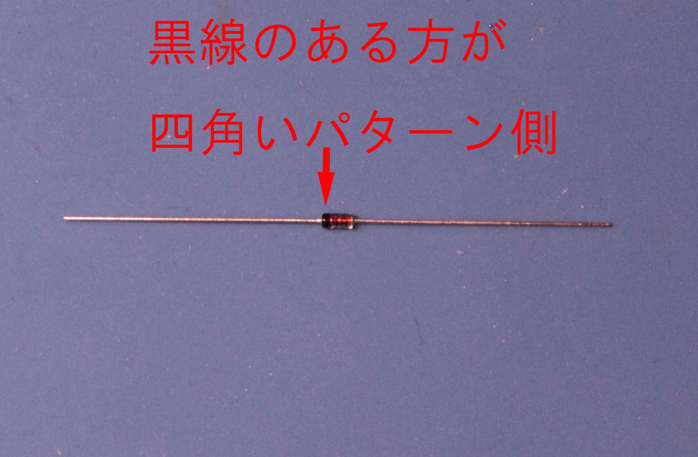
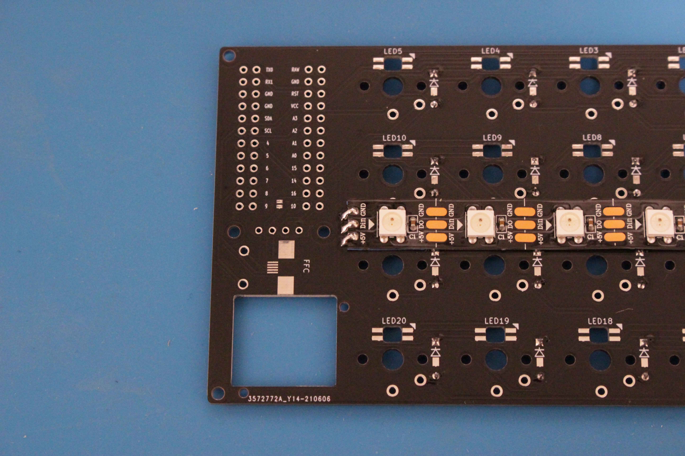
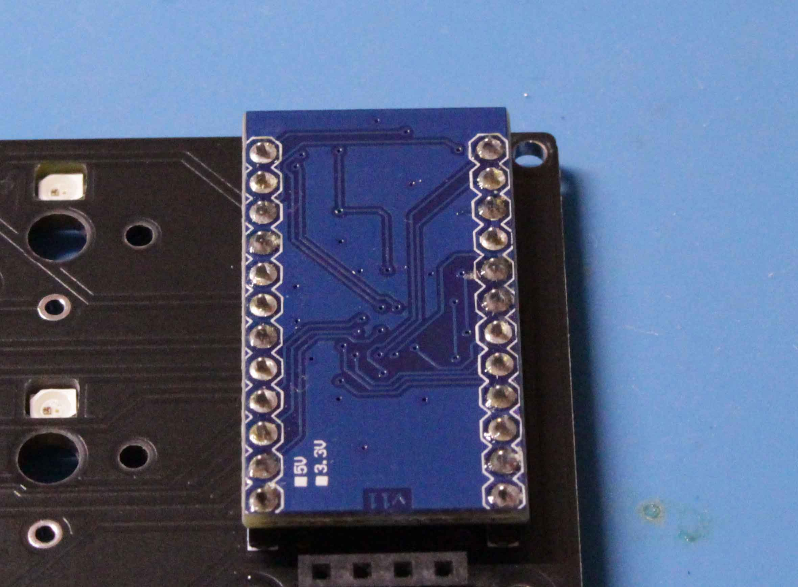
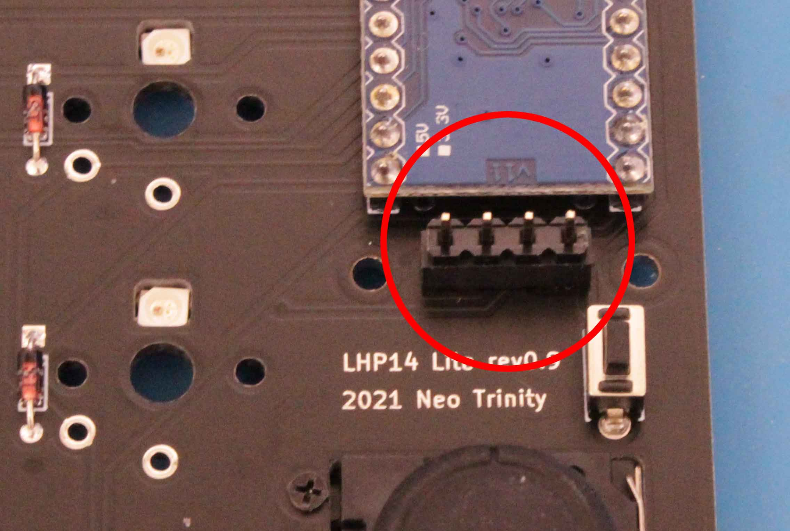
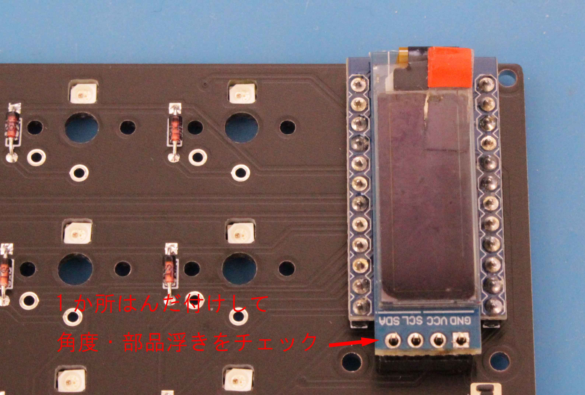
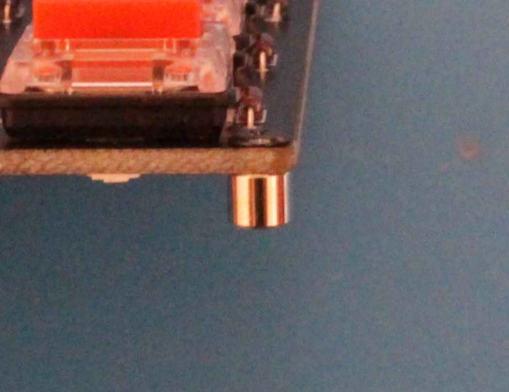
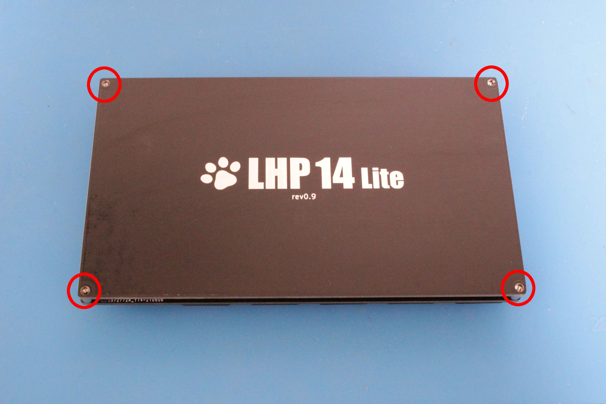

# LHP14 Lite　ビルドガイド

  
 
 
 
 

## はじめに

横12センチ、縦7センチのコンパクトなアナログスティック付き左手デバイスです。
スティックの操作感や機能は通常版のLHP14が優れておりますが、そこまでキー数を必要としない方、手軽に左手デバイスを自作したい方向けに開発しました。
 
 
 
 

## キット内容

・本体基板2枚（ベース、メイン基板）

・丸スペーサー　M2xL3.5mm　4個

・丸スペーサー　M2xL9mm　2個

・スリムヘッド小ねじ M2x5mm 黒色　2個

・スリムヘッド小ねじ M2x3mm 黒色　10個

・マイクロねじ M1.4x5mm　2個

・マイクロナット M1.4　2個

・リードタイプダイオード1N4148　20個

・タクタイルスイッチ（リセット用）

・OLEDシールド用アクリル板

・脚用ウレタンクッション　4個 

・FFCコネクタ（実装済み）
※FFCコネクタのはんだ付けは難易度が高いので当方で行い、動作確認の上、出荷します。
 
 
 
 

## キット以外に必要な部品

・Pro Micro （コンスルー付き）  
※最近発売されている厚みのあるType-C ProMicroをお使いの際は高さ3.5mmの12Pinコンスル―をご使用ください。  
(その際、OLEDのソケット差し込み深さは少し浅くなる場合があります。)  
MicroUSBタイプ、Elite-C、薄型のType-C ProMicroは2.5mmの12Pinコンスル―でOKです。  

・OLEDモジュール （ピンソケット付き）

・Kailh Choc V1ロープロファイルスイッチ　20個

・Choc V1ロープロスイッチ用のキーキャップ1U　20個

※rev1.0からChoc V1だけではなく、Choc V2スイッチにも対応しました。  
ただし、V2用のキーキャップは縦ピッチ18mm以下の狭ピッチキーキャップをお使いください。  
通常サイズのキーキャップは前後のキーと干渉します。

・Micro USB ケーブル

・NintendoSwitchジョイコン修理用のアナログスティック　1個

【注意】
ジョイコン修理用のアナログスティックは多種ありますが、中には特性の良くないものもあるようです。  
Amazonのレビューなどを参考に、出来るだけ評判の良いパーツをご入手ください。
（当方は改良型第四世代の黒いパッケージのものを使って安定しておりますが、レビューを見ると不良品もあるようです。当方の経験でもJoystickの性能はばらつきが多く、良品の入手には運が絡んできます；；）  

#### オプション

・発光ダイオード　YS-SK6812MINI-E　20個

もしくは

・フルカラーシリアルLEDテープ 6個タイプ
（カットして5個発光として使用します）

※上記は同時使用はできません。製作時にYS-SK6812MINI-Eを使うか、LEDテープで行くか決めてからパーツを集めてください。  
YS-SK6812MINI-Eを使う方が難しいですが、見栄えはこちらが優れていると思います。

※これらは[**遊舎工房**](https://shop.yushakobo.jp/)や[**TALP KEYBOARD**](https://talpkeyboard.net/)、amazonなどで購入可能です    
 
 
 
 

## 必要な工具・材料

・はんだごて（温度調整式を推奨）

・はんだ（出来るだけ細いもの。0.6mmと0.3mmがあればgood）

・こて先クリーナー

・はんだ吸取線（はんだ付けを失敗した時などに使用）

・フラックス（はんだ付けする部品に塗布するとハンダ付けが容易になります）

・フラックスクリーナーと綿棒（余分なフラックスを掃除するとき使用）

・精密ドライバー（+）

・ニッパー（ダイオードのリード（足）や使用済み吸取線をカット）

・マスキングテープ（ダイオードなど仮固定用）  

・はさみ（テープLEDのカットに使用）  
 
 
 
 

## 作り方

#### ※電子部品の多くは取り付ける向きがあります。逆に取り付けると動かなかったり壊れたりします！

#### ※基板にも表裏があります。表に取り付ける部品、裏に付ける部品がありますので注意！

#### ※電子部品（特にLED）は熱に弱いので素早くはんだ付けしましょう！

#### ※複数個所をはんだ付けする部品は、まず1か所目のはんだ付けが終わったら、向きや部品の浮きなどをチェックしてください。はんだ付けが1か所であれば、リカバリは容易です。   

 
 
 
 

### １．ダイオードのはんだ付け

ダイオードをはんだ付けします。ダイオードには極性（取付方向）があるので、ダイオードについている黒線を目印にします。  
 
 
 

ダイオードを基板の表面D1～D20にはんだ付けします。足をコの字に曲げて、基板の表面にセットして裏をはんだ付けします。向きはシルク印刷を参考にセットします。（黒線側が四角いパターン側になる）    
 
 
 

ダイオードを1行ごとにセットしたらマスキングテープで固定すると作業中に外れずに作業しやすくなると思います。    
 
 
 

### ２．LEDのはんだ付け（オプション）

本機はYS-SK6812MINI-Eのはんだ付けを推奨しておりますが、LEDは熱に弱くはんだ付けの難易度が比較的高いので、作業難易度が低いLEDテープを使うことも出来るよう設計しました。  
ただ、LEDテープを使ったアンダーグロー照明はアクリル板のベースを使ったときにより一層効果を発揮する方法なので、本機のような光を裏面に透過しないキーボードの場合は光り方が弱くなってしまいます；；  
**注意！！！   YS-SK6812MINI-EとLEDテープの同時使用はできません。**  
 
 
 
 
 

#### ・LEDテープを使う方法

上から「GND」「DIN」「+5V」と書かれた側を左に、上から「GND」「DO」「+5V」と書かれた側を右にして、右側1個のLEDテープをカットします。  
 
 
 

基板裏面の「GND」「DIN」「VCC」と書かれたパターンとLEDテープの「GND」「DIN」「+5V」と書かれた側をはんだ付けします。  
 
 
 

#### ・YS-SK6812MINI-Eを使う方法

基板の裏面から、LED取付穴にYS-SK6812MINI-Eをはめ込んで足をはんだ付けしていきます。  
LEDには極性がありますので足の向きに注意します。（斜めカットされた足が白い三角側になります）  
LEDは極度に熱に弱いので、温度調整式のはんだごてを使い、270度以下の出来るだけ低温で作業するとトラブルが起こりずらくなります。  
フラックスや細いはんだを使うことも推奨です。  
 
 
 

### ３．ジョイスティックの取り付け

M1.4x5mmねじとナットでジョイスティックを固定します。(2か所）  
基板裏面のコネクタにジョイスティックのフラットケーブルを奥まで差し込んだら、コネクタの黒い部品を押し込んでケーブルを固定します。  
 
 
 

### ４．リセットスイッチ、OLEDソケットはんだ付け

リセットスイッチとOLEDソケットをはんだ付けします。   
 
 
 

### ５．ProMicroの組み立て

コンスル―付きのProMicroにはピンが別に付いている場合が多いですが、今回はコンスルーを使用します。
コンスルーとは基板とProMicroを脱着可能にするスプリングピンです。（ProMicroはUSB端子が取れたりとか意外と壊れることが多いのです；；）    
 
 
 

基板の表面にコンスルーを手で差し込みます。**（絶対に基板にはんだ付けしないでください）**  
コンスルーの取り付けにも向きがあります。金色の点が上になるようセットします。
向きも同じになるようにします  
 
 
 

コンスルーとProMicroをはんだ付けします。Promicroは部品がついていない面を上にします。  
最初に1か所だけはんだ付けして、ProMicroに浮きがないかチェックして残りのピンをはんだ付けしましょう。  
 
 
 
 
 

### ６．OLEDの取り付け

OLEDソケットにピンを差し込みます。  
 
 
 

OLEDをピンにはんだ付けします。  
OLEDはとても角度がズレやすいので、4ピンを一気にはんだ付けせず、まずは1か所ハンダ付けします。  
もしOLEDがズレているようでしたら、はんだを溶かし直して位置を調整します。  
位置がOKでしたら残りの3ピンをはんだ付けします。  
 
 
 
 
 

### ７．スイッチの取り付け

基板にスイッチをはんだ付けします。  
端子2か所を一度にはんだ付けせずに1か所のみはんだ付けしてスイッチの浮きや足折れがないかチェックします。  
 
 
 

本機はコンパクトな外観にするためKailh Chocスイッチ専用設計です。CherryMXスイッチは使用できません。  
 
 
 

### ８．ベースプレート取り付け

基板のカド4か所に六角(丸)スペーサーM2xL3.5mmをスリムヘッド小ねじ M2x3mmでねじ止めします。  
 
 
 

六角(丸)スペーサーM2xL9mm　2個をスリムヘッド小ねじ M2x3mmでねじ止めします。  
 
 
 

ベースプレートをスリムヘッド小ねじ M2x3mmでねじ止めします。  
 
 
 

ベースプレートはリバーシブルデザインです。お好きな面をお選びください(´∀｀)  
 
 
 

4隅に滑り止めのウレタンクッションを貼り付けます。 
 
 
 

### ９．完成

スリムヘッド小ねじ M2x5mm 2本でOLEDシールドのアクリル板を取り付けます。  
好みのキーキャップを取り付けたら完成です！  
 
 

### **お疲れ様でした。**

 
 

[ ＞＞動作テスト](./LHP14Lite_hardware_test.md/) 

