# 動作テスト

LHP14LiteはQMK firmwareという、キーボード用のオープンソースファームウェアで動作します。  
当方の現環境はwindows11、QMK MSYS 1.10.0(QMK ver 0.29.4)、QMK Toolbox(ver 0.3.3)です。
 
 
 

### １．QMK-MSYSのセットアップ

・[公式サイト](https://msys.qmk.fm/)からLatest versionのQMK_MSYS.exeをダウンロードします。
 
 

 

 

 
 
ダウンロード時、警告のメッセージが出ますが、赤丸部分をクリックしてダウンロードします。
 
 
 
・ダウンロードしたQMK_MSYS.exeを実行します。

 
 
 

・QMK MSYSを起動します。   
　黒い画面が開き、＄が出たら、qmk setupと打ち込み、エンターを押します。

・設問が出ますが全てy(es)で答えます。

・cloning into...　と出てファイルのアップデートが始まりますが、終わるまで待ちます。

・QMK is ready to goと出て、＄の横にカーソルが出てきたらQMK MSYSセットアップ完了です。
 
 
 

### ２．QMK Toolboxのインストール（RP2040では必要ありません）

・[公式サイト](https://github.com/qmk/qmk_toolbox/releases)からqmk_toolbox_install.exeをダウンロードし実行します。  
同じように警告が出ますが、インストールを進めていきます。
 
 
 

### ３．テストファームの書き込み

・[LHP14ファームウェア置き場](https://github.com/LHPbackup/LHP14-firmware)からLHP14Liteのファームウェアをダウンロードします。  
　Codeと書いた緑のボタンを押し、Zipファイルをダウンロード、解凍します。

**ATmega32U4搭載ProMicroをお使いの場合**

・C:\Users\ユーザー名\qmk_firmware\keyboards\に、lhp14lite_dフォルダをフォルダごとコピーしてください。

・QMK Toolboxを起動します。

・右上にあるAuto-Flashをチェックします。

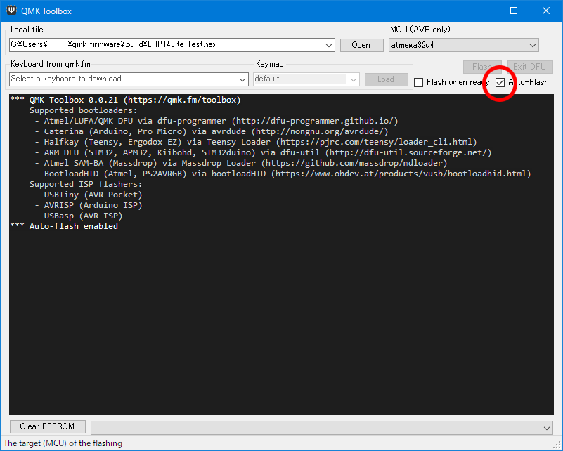

 
 

・lhp14lite_dフォルダ内のlhp14lite_d_test.hexをQMK Toolboxにドラッグ＆ドロップします。  
(ドラッグ＆ドロップできない場合はOpenボタンを押してlhp14lite_d_test.hexファイルを指定する)  

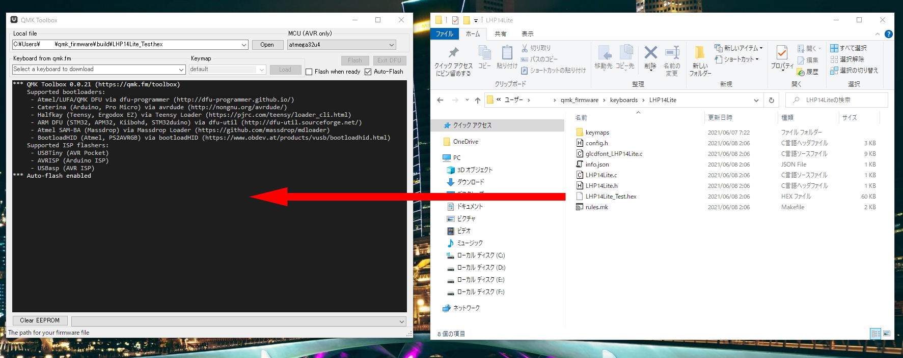

 
 

・PCにLHP14Liteをつなぎ、LHP14Liteのリセットボタンを押すと（ProMicroによっては2度押し）ファームウェアが書き込まれます。

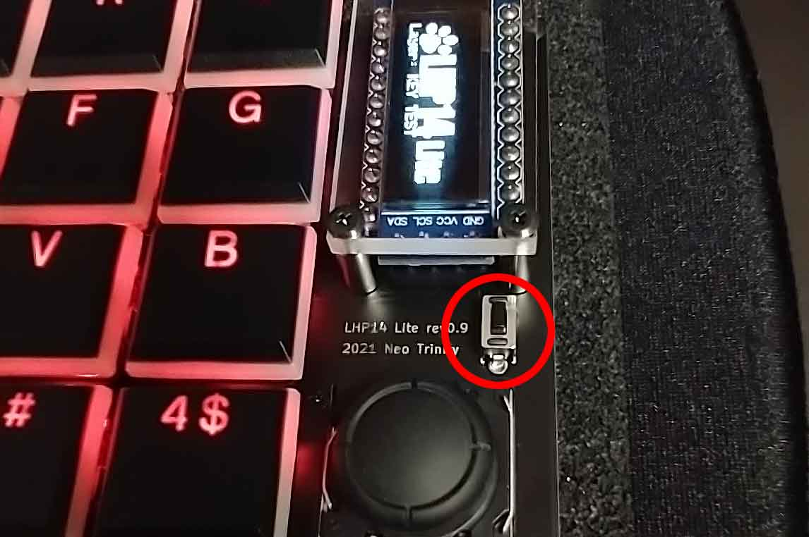

 
 

**RP2040をお使いの場合**

・C:\Users\ユーザー名\qmk_firmware\keyboards\に、lhp14lite_rp2040dフォルダをフォルダごとコピーしてください。

・PCにLHP14Liteをつなぎ、リセットスイッチをゆっくり目にダブルクリックするとウインドウが開きます。  

・lhp14lite_rp2040dフォルダ内のlhp14lite_rp2040d_test_sparkfun.uf2  
(Adafruit KB2040をお使いの際はlhp14lite_rp2040d_test_adafruit.uf2)  
を開いたウィンドウにドラッグ＆ドロップします。  

・RP2040では拡張子がuf2のファイルをファームウエアとして使用します。QMKでRP2040のファームをビルドするとuf2ファイルが生成されます。 

 
 
 

### 4．動作テスト

・テストファームの書き込みが成功するとRGBLEDを搭載している場合、全てのLEDが七色に点灯します。

・OLEDのLayer表示が「KEY TEST」になっていることを確認します。

・メモ帳などのテキストエディタを開いてLHP14Liteの各キーを押し、対応した文字が出てくれば正常。

・レイヤースイッチを押し、OLEDのLayer表示をRGB LED TESTに切り替えてください。リセット（2列目2行目）でRGBLEDをリセットして全て赤に変わります。RGBLEDアニメーション変更（1列目2行目）を押すと発光パターンが切り替わっていきます。

・各キーの詳しい割り当ては\lhp14lite_d\keymaps\test\のkeymap.cを参照してください。

**・2025/8月更新のテストファームから、ADC(アナログ-デジタルコンバータ)の数値を計測し、これをジョイスティックの可動範囲に充てる方式に変更しました。**  
**性能のばらつきが大きいジョイコンスティックでも使用可能になるかもしれません。(special thanks まるしぃ & HellSingCoder)**  

**・OLEDにX:〇〇〇  Y:〇〇〇の表示が出ますので、ジョイスティックを左右上下に動かしてX、Yそれぞれの最小値、中央値、最大値をチェックしておきます。**

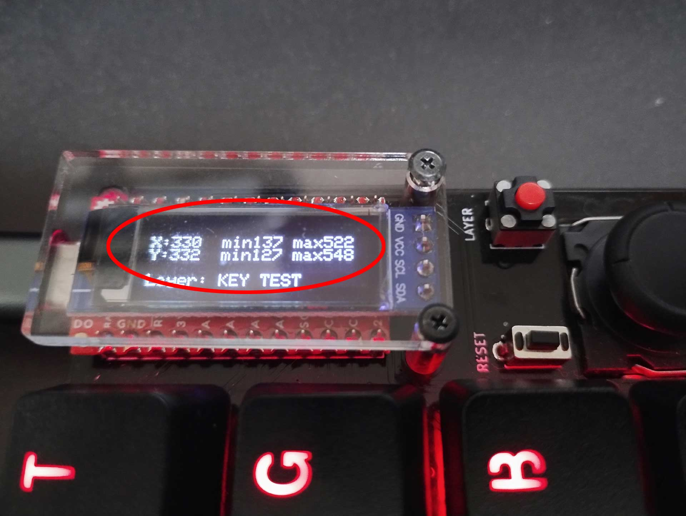

 
 

**注意：ATmega32U4用のテストファームは何故か不安定で、LayerのOLED表示切替が遅延します。RP2040版は安定しており、推奨です。[秋月のRP2040 Kee Boar Driver](https://akizukidenshi.com/catalog/g/g117312/)は高速・高性能・低価格でおすすめ。**

 
 
 

### 5．キーマップ作成とファームウエアコンパイルの準備

製作したLHP14LiteのProMicroの種類、RGBLEDの有無やLEDの種類に応じて、ファームウエアのkeyboard.jsonファイルを書き換えます。

lhp14lite_rp2040dフォルダにあるkeyboard.jsonファイルをメモ帳などのテキストエディタで開き、必要に応じて書き換えます。  

【SparkFun・Adafruit2040】  
・SparkFun RP2040をご使用の場合：16行目を有効化して、17行目  
`"cols": ["GP27", "GP26", "GP18", "GP20", "GP19", "GP10", "GP9"], `  
をコメントアウト（//をつける）    

・Adafruit KB2040をご使用の場合：17行目を有効化して、16行目  
`"cols": ["GP27", "GP26", "GP22", "GP20", "GP23", "GP21", "GP9"],`  
をコメントアウト（//をつける）

【LEDの有無・種類】  
　　　テープLED：`"led_count": 6,`に変更

　　　SK6812MINI-E or RGBLEDなし：`"led_count": 20,`（変更なし）

　　　※`"led_count": 20,`以外の場合は次の行の`"led_map": [0, 1, 2, 3, 4, 9, 8, 7, 6, 5, 10, 11, 12, 13, 14, 19, 18, 17, 16, 15]`は削除するか、コメントアウトしてください。
 
 
keymaps/mymapフォルダにあるkeymap.cファイルをテキストエディタで開き、先ほどチェックしたOLEDのX,Y数値に書き換えます。
9行目以下の  
`#define min_x 〇〇〇`  
`#define med_x 〇〇〇`  
`#define max_x 〇〇〇`  

`#define min_y 〇〇〇`  
`#define med_y 〇〇〇`  
`#define max_y 〇〇〇`  
をチェックした最小値、中央値、最大値に書き換えます。

 

QMK MSYSを起動し、  
cd qmk_firmware⏎  
make lhp14lite_rp2040d:mymap⏎  
(ATmega32U4のProMicro使用の場合は、make lhp14lite_d:mymap⏎)  
とコマンドを入力しmymapファームをコンパイルする。

 

C:\Users\ユーザー名\qmk_firmware\,build\にlhp14lite_rp2040d_mymap.uf2  
(ATmega32U4の場合はlhp14lite_d_mymap.hex)  
ファイルが生成されているので、これをLHP14Liteに書き込みます。  

 

 

 

### 6．ジョイスティックの調整

※ジョイスティックをキャリブレーションする前に、windowsを再起動しておきます。

・コントロールパネルのハードウェアとサウンドを左クリックします。

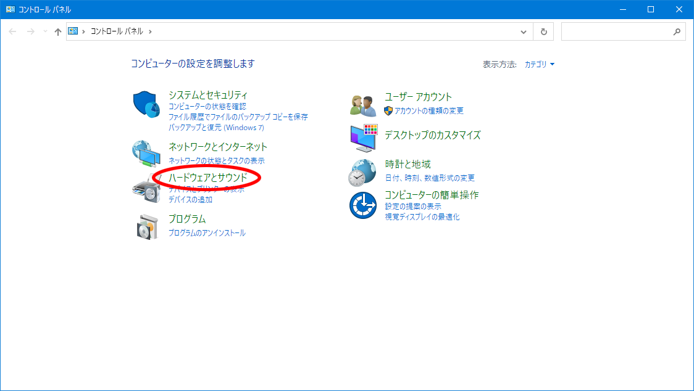
 
 
 
・デバイスとプリンターを左クリックします。

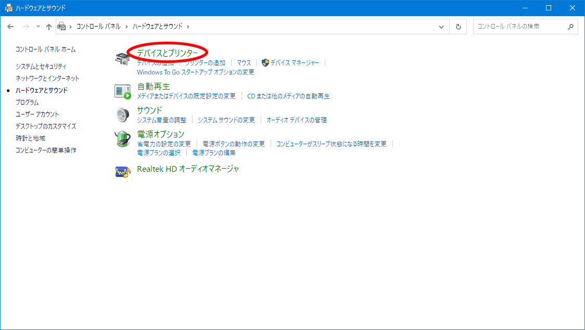
 
 
 
・LHP14Liteを**右クリック**します。

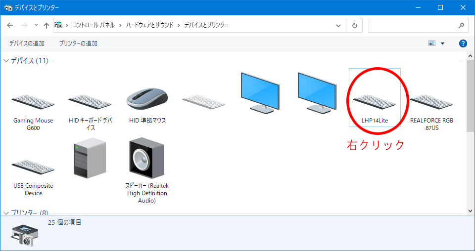
 
 
 
・ゲームコントローラーの設定を左クリックします。

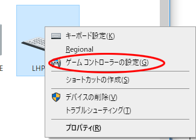
 
 
 
・LHP14Liteを選択し、プロパティを左クリックします。

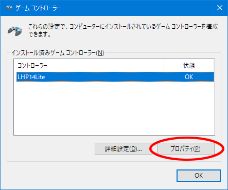
 
 
 
・設定タブを選択して、調整を左クリックします。

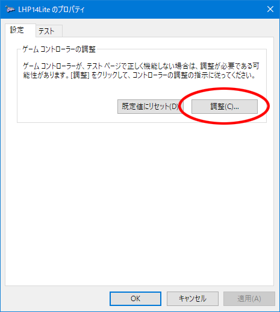
 
 
 
・次へを左クリックします。

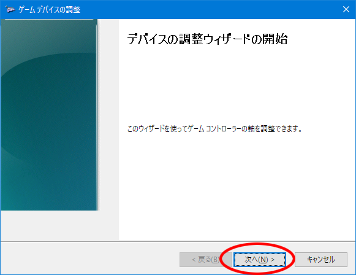
 
 
 
・次へを左クリックします。

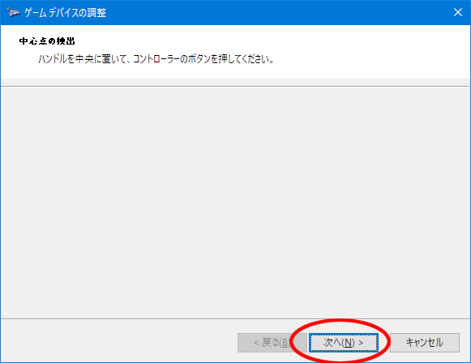
 
 
 
・あまり力を加えずに外周をなぞるようにスティックを軽く回します。
カーソルが安定したら次へを左クリックします。

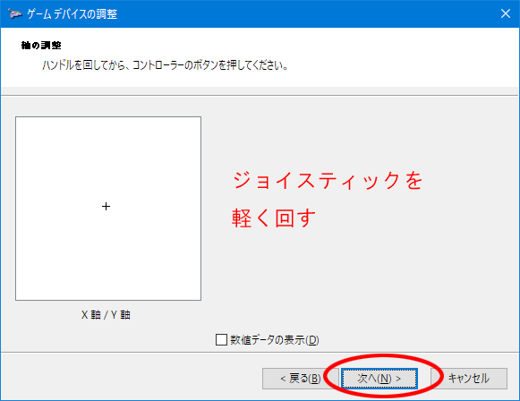
 
 
 
・次へを左クリックします。

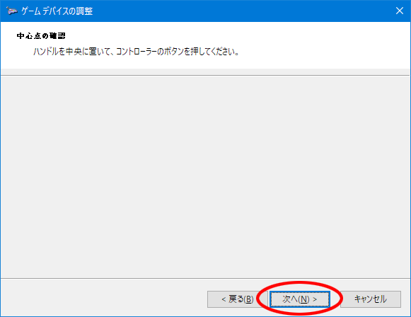
 
 
 
・完了を左クリックします。

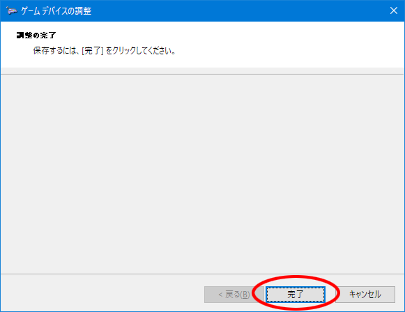
 
 
 
・ジョイスティックを動かし、カーソルが追従しているかチェックします。

ジョイスティック押し込みでボタン1が反応するかチェックします。

動作に問題なければOKを左クリックします。

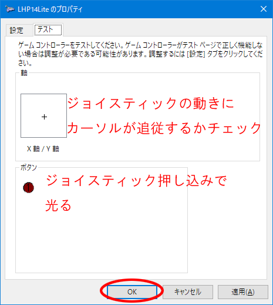
 
 
 
 
### お疲れ様でした。上手く動きましたか？？

 
 

[ ＞＞キーマップを作る(LHP14のページに飛びます。適宜Liteに読み替えて下さい<(_ _)>)](./LHP14j_make_layer.md/) 
