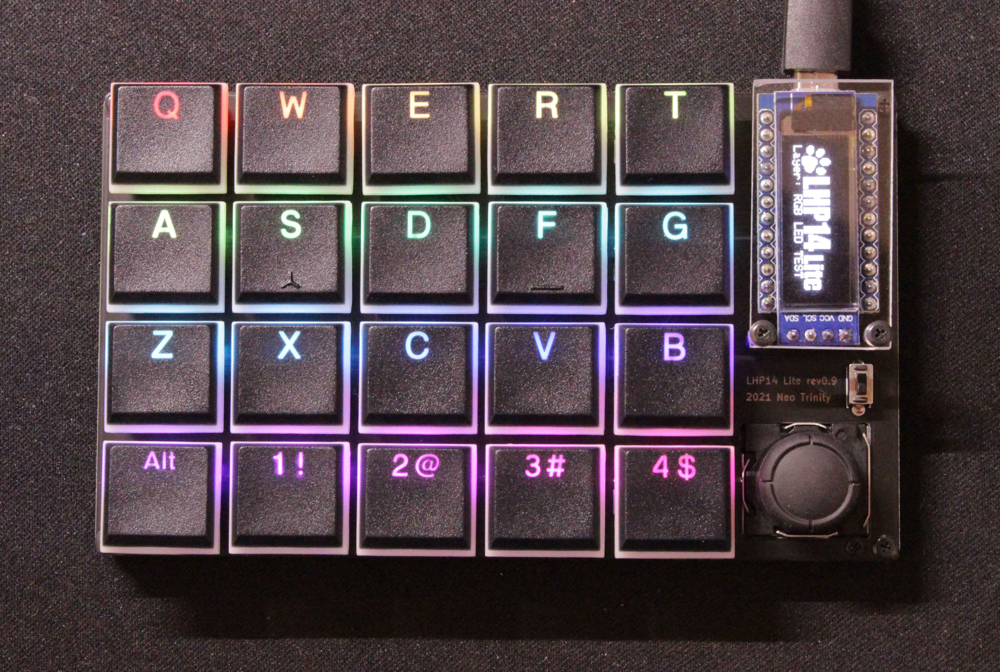
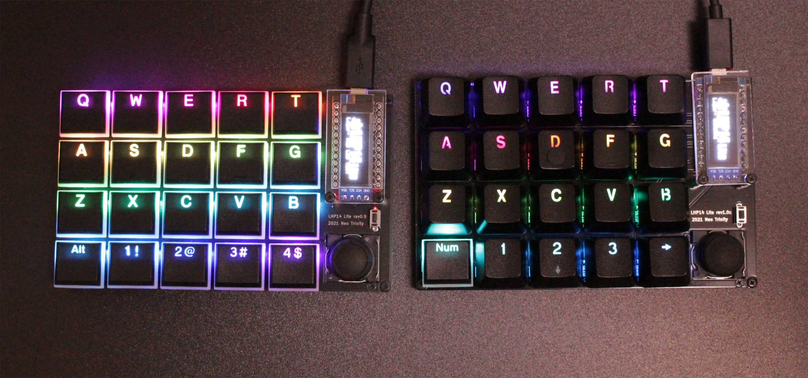

# LHP14 Lite Photo

rev0.9とChocV1の組み合わせ。  
薄型のスイッチとキーキャップでスタイリッシュ。
 
 
 

rev1.0からChocV2にも対応。
 
 
 

rev1.0cからChocV2使用時にはCherryMXキーキャップが使用可能になりました。
 
 
 

大きさの比較。rev1.0cは縦74mmになりました。ChocV2+CherryMXキーキャップ使用時は厚みも増加します。
 
 
 