# LHP14 Lite rev1.0d　ビルドガイド

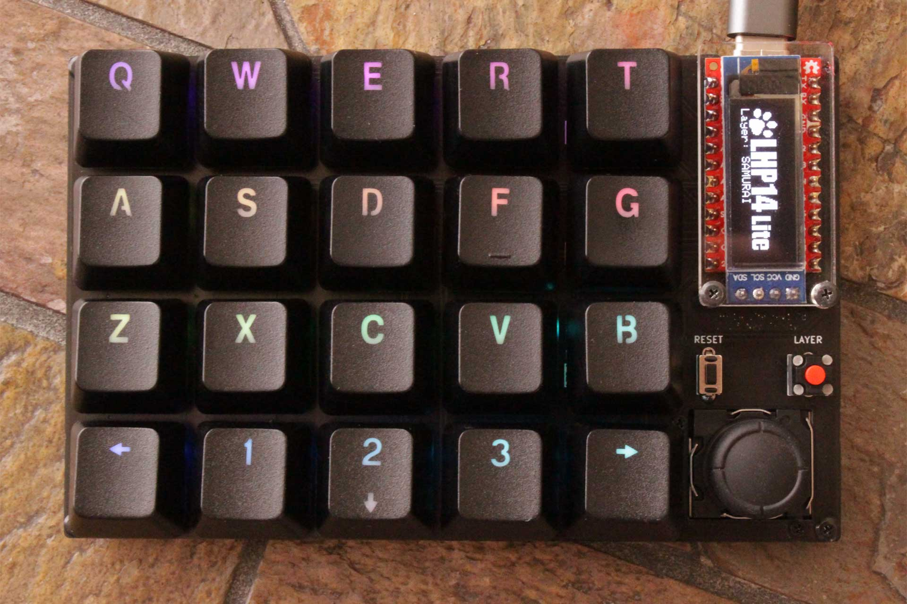  
 
 
 
 

## はじめに

横12センチ、縦7.5センチのコンパクトなアナログスティック付き左手デバイスです。
スティックの操作感や機能は通常版のLHP14が優れておりますが、そこまでキー数を必要としない方、手軽に左手デバイスを自作したい方向けに開発しました。
 
 
 
 

## 前バージョンからの変更点

・従来のProMicro(MCU:ATmega32U4）に加え、RP2040搭載のProMicro（[SparkFun Pro Micro RP2040](https://www.sparkfun.com/products/18288)、[Adafruit KB2040](https://www.adafruit.com/product/5302)）が使用可能になりました。  

・Layer切り替えのスイッチを新設しました。  

・SK6812MINI-E装着時に必要なチップコンデンサをキット付属から外しました。  

・2025/8月以降の3rdロットから基板製造メーカーを再々変更。基板色がマットブラックになりました。

・製造コストは下がりましたが、質感も少し下がった気がするので、バーゲンプライスでご提供します。^^;

・ファームウエアを変更しました。（ADCの数値を計測し、ジョイスティックのパラメータに充てる方式に変更。バラツキが大きいスティックでも使用可能）

[**前バージョンのビルドガイドはこちら**](./LHP14Lite_rev_c_buildguide.md/)
 
 
 

## キット内容

・本体基板2枚（ベース、メイン基板）

・丸スペーサー　M2xL3.5mm　4個

・丸スペーサー　M2xL9mm　2個

・スリムヘッド小ねじ M2x5mm 黒色　2個

・スリムヘッド小ねじ M2x3mm 黒色　10個

・マイクロねじ M1.4x5mm　2個

・マイクロナット M1.4　2個

・ダイオード SMDタイプ　20個

・タクタイルスイッチ（リセット用）　1個

・Kailhミュートスイッチ（レイヤー切替用）　1個

・OLEDシールド用アクリル板

・脚用ウレタンクッション　4個 

・ジョイスティック側のチップコンデンサ(2012 0.1uF)　2個

・FFCコネクタ（実装済み）
※FFCコネクタのはんだ付けは難易度が高いので当方で行い、動作確認の上、出荷します。

 
 
 
 

## キット以外に必要な部品

・Pro Micro(ATmega32U4搭載ProMicro、SparkFun Pro Micro RP2040、Adafruit KB2040。[2040搭載のもの推奨](https://akizukidenshi.com/catalog/g/g117312/))　1個 

・コンスルー（12ピン高さ2.5mm推奨）　2個

・OLEDモジュール・ピンソケット付き（ピンソケット・ヘッダ型番:廣杉計器FSS-41035-04,PSS-410153-04）　1個

・Kailh Choc V2　もしくは　Choc V1スイッチ　20個

・CherryMX対応のキーキャップ(Choc V2使用時)  
　もしくは　Choc V1用のキーキャップ(Choc V1使用時)　20個

・USB ケーブル

・NintendoSwitchジョイコン修理用のアナログスティック　1個

【注意】
ジョイコン修理用のアナログスティックは多種ありますが、中には特性の良くないものもあるようです。  
Amazonのレビューなどを参考に、出来るだけ評判の良いパーツをご入手ください。
（当方は改良型第四世代の黒いパッケージのものを使って安定しておりますが、レビューを見ると不良品もあるようです。当方の経験でもJoystickの性能はばらつきが多く、良品の入手には運が絡んできます。）  

【注意２】  
ChocV2スイッチ使用時には、一般に売られているCherryMX用キーキャップ(キー取り付け部が十字のもの)が使えます。

ChocV1スイッチをお使いの場合はV1専用のキーキャップが必要です。

#### オプション

・発光ダイオード　[SK6812MINI-E](https://akizukidenshi.com/catalog/g/g115478/)　20個  
・2012サイズ　[チップ積層セラミックコンデンサ　0.1μＦ](https://akizukidenshi.com/catalog/g/g117576/)　20個

もしくは

・フルカラーシリアルLEDテープ 6個タイプ

※上記は同時使用はできません。製作時にSK6812MINI-Eを使うか、LEDテープで行くか決めてからパーツを集めてください。  
SK6812MINI-Eを使う方が難しいですが、より綺麗に発光します。

※これらは[**遊舎工房**](https://shop.yushakobo.jp/)や[**TALP KEYBOARD**](https://shop.talpkeyboard.com/)、[**秋月電子**](https://akizukidenshi.com/catalog/default.aspx/)、amazonなどで購入可能です  

※RP2040搭載のProMicroは秋月電子や共立エレショップなどで取扱いがあります。
[**秋月電子**](https://akizukidenshi.com/catalog/g/gM-17312/)のこちらの商品は安価・高性能、USB-Cなのでお勧めです。
 
 
 
 

## 必要な工具・材料

・はんだごて（温度調整式を推奨）

・はんだ（出来るだけ細いもの。0.6mmと0.3mmがあればgood）

・こて先クリーナー

・はんだ吸取線（はんだ付けを失敗した時などに使用）

・フラックス（使用するとハンダ付けが容易になります）

・フラックスクリーナーと綿棒（余分なフラックスを掃除）

・精密ドライバー（+）

・精密ピンセット

・テスター

・ニッパー（はんだ吸取線をカット）  
 
 
 
 

## 作り方

#### ※電子部品の多くは取り付ける向きがあります。逆に取り付けると動かなかったり壊れたりします！

#### ※基板にも表裏があります。表に取り付ける部品、裏に付ける部品がありますので注意！

#### ※電子部品（特にLED）は熱に弱いので素早くはんだ付けしましょう！

#### ※複数個所をはんだ付けする部品は、まず1か所目のはんだ付けが終わったら、向きや部品の浮きなどをチェックしてください。はんだ付けが1か所であれば、リカバリは容易です。

 
 
 
 

### ０．RP2040 ProMicroのチェックとBoot用ファームの書き込み

### （従来のProMicro使用時はこの項目をパス）

 
 

・[LHP14ファームウェア置き場](https://github.com/LHPbackup/LHP14-firmware)からLHP14Liteのファームウェアをダウンロードします。  

　Codeと書いた緑のボタンを押し、Zipファイルをダウンロード、解凍します。  

 
 
 

　

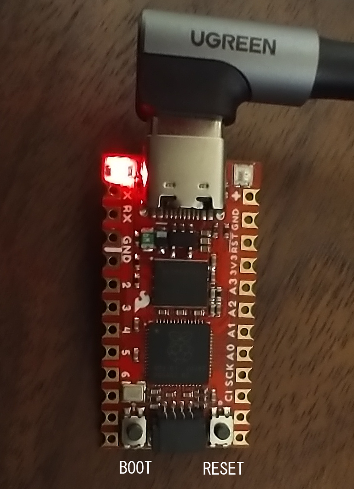

PCにRP2040 ProMicroを繋ぎます。  
BOOTを押しながらRESETを押します。  
 
 
 

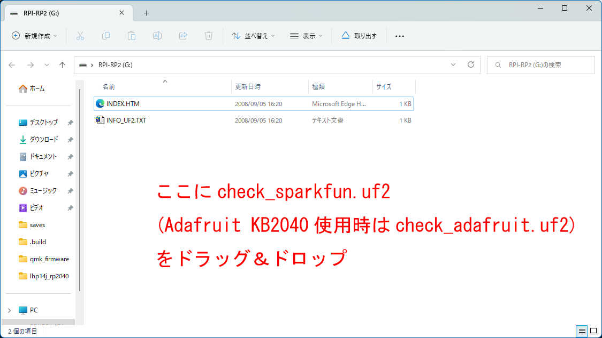

ウィンドウが開くので、ここにlhp14lite_rp2040dフォルダ内にある「check_sparkfun.uf2」（AdafruitKB2040使用の際は「check_adafruit.uf2」）をドラッグ＆ドロップで放りこみます。    
 
 
 

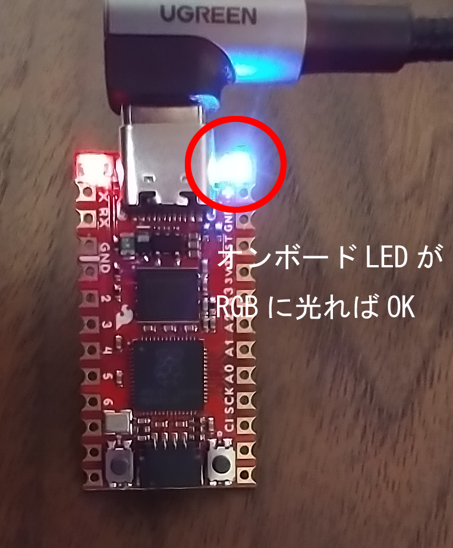

ProMicroにオンボード搭載されているLEDが赤、緑、青に光ればOKです。     

これでLHP14Liteのリセットボタンをダブルクリックでウィンドウが開くようになります。
 
 
 

### １．ダイオードのはんだ付け

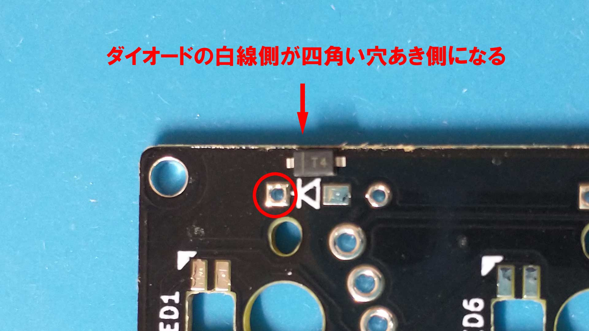

チップタイプのダイオードを**基板裏面に**はんだ付けします。（LEDやコンデンサのパッドがある方が裏側です）  
ダイオードには極性（取付方向）があるので、ダイオード表面の白線側が基板パターンの四角い穴あき側になるようにします。  
|◁マークがある20か所がダイオードを付ける場所です。  

 
 
 

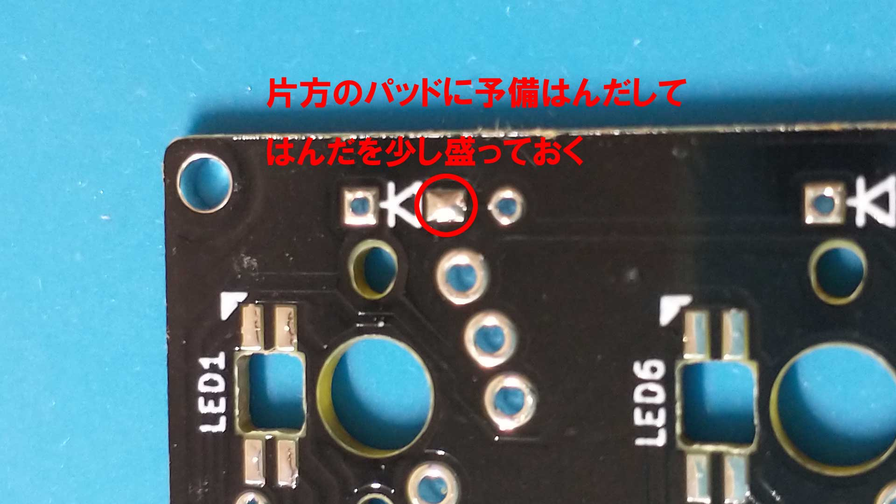

パッドの穴の開いていない側に予備はんだして、少量のはんだを盛っておきます。    
 
 
 

ピンセットでダイオードをつまんで、位置を合わせながら盛ったはんだを溶かしつつはんだ付けします。  
位置が定まったら、ダイオードを上から押さえてはんだを再度溶かして部品浮きを修正します。    
 
 
 

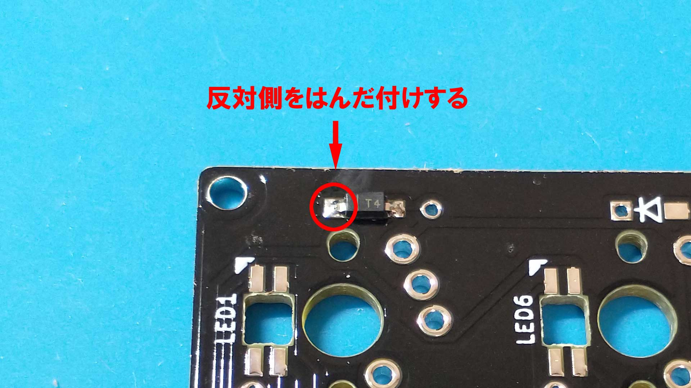

反対側の穴あき四角パッド側もはんだ付けします。  
このような手順でダイオード20個をはんだ付けしていきます。    
 
 
 

### ２．LEDのはんだ付け（オプション）

本機はSK6812MINI-Eのはんだ付けを推奨しておりますが、LEDは熱に弱くはんだ付けの難易度が比較的高いので、作業難易度が低いLEDテープを使うことも出来るよう設計しました。  
ただ、LEDテープを使ったアンダーグロー照明はアクリル板のベースを使ったときにより一層効果を発揮する方法なので、本機のような光を裏面に透過しないキーボードの場合は光り方が弱くなってしまいます。  
**注意！！！   SK6812MINI-EとLEDテープの同時使用はできません。**  
 
 
 
 
 

#### ・LEDテープを使う場合

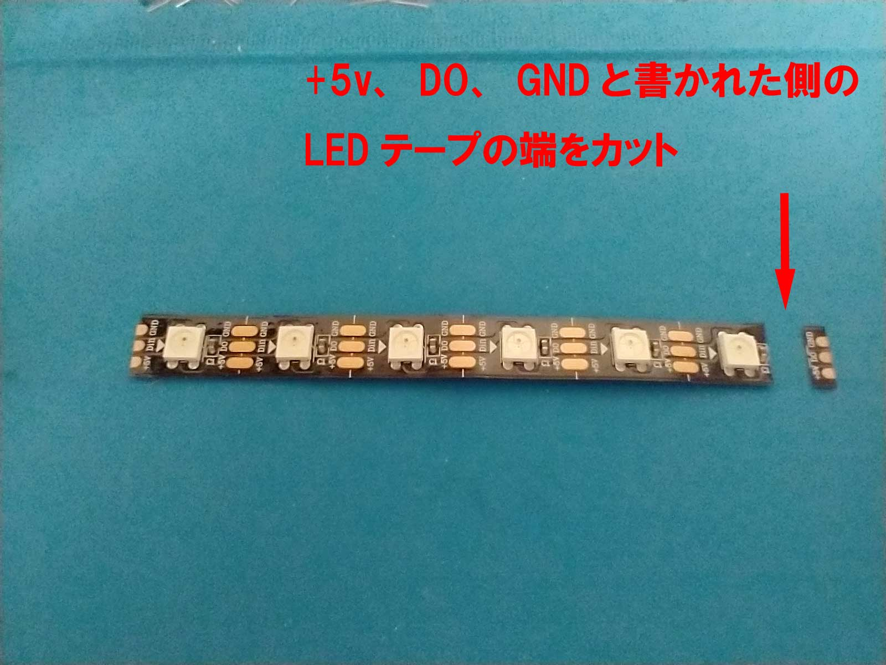

上から「GND」「DIN」「+5V」と書かれた側を左に、上から「GND」「DO」「+5V」と書かれた側を右にして、LEDテープ右側を写真のように少しカットします。  
 
 
 

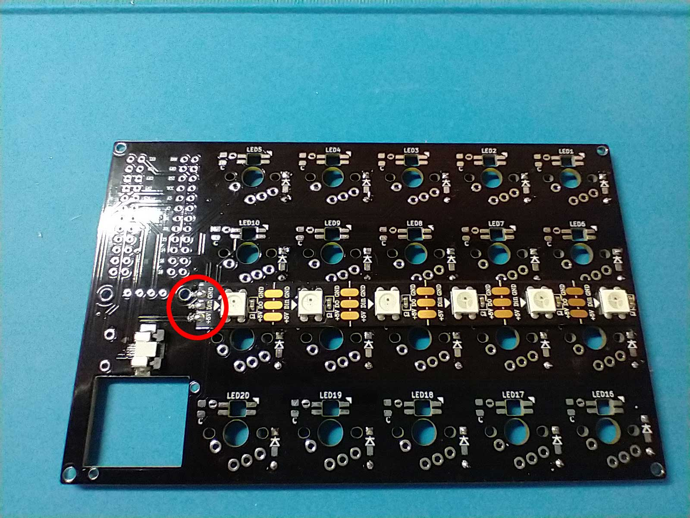

基板裏面の「GND」「DIN」「+5v」と書かれたパターンとLEDテープの「GND」「DIN」「+5V」と書かれた側をはんだ付けします。  

 
 
 

#### ・SK6812MINI-Eを使う場合

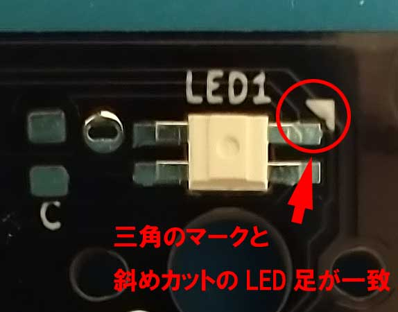

基板の裏面から、LED取付穴にSK6812MINI-Eをはめ込んで足4本をはんだ付けしていきます。  
製造時の誤差ではめ込みがきつい場合は細い棒やすり等で四角穴を少し広げて下さい。  

LEDには極性がありますので足の向きに注意します。（斜めカットされた足が白い三角側になります）  
LEDは極度に熱に弱いので、温度調整式のはんだごてを使い、出来るだけ低温で作業するとトラブルが起こりずらくなります。  
フラックスや細いはんだを使うことも推奨です。  
 
 
 

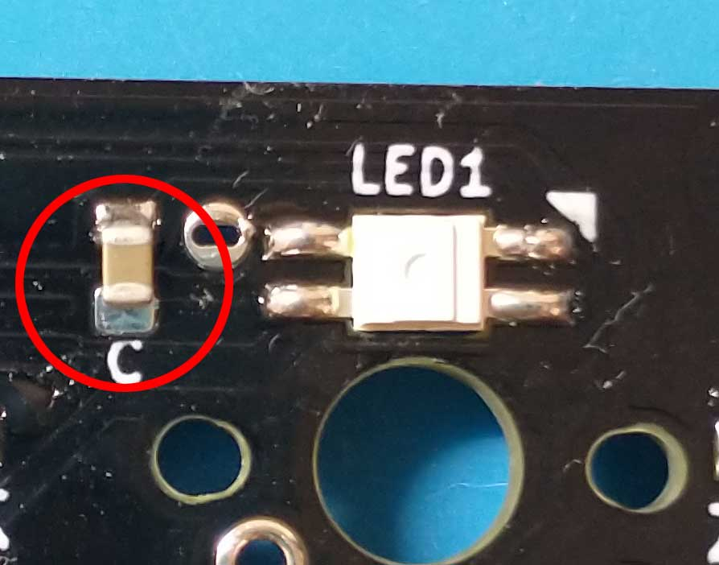

「C」と書かれたパッド20か所に、ダイオードと同じ要領で、付属のチップコンデンサをはんだ付けしていきます。コンデンサに裏表や極性はありません。  
**（この作業はテープLEDを使用の場合は必要ありません）**  

はんだ付けが終わったらテスターを使用し、コンデンサをはんだ付けした2か所にテスターを当てて**導通がないこと**を確認してください。 導通がある場合は回路がショートしています。コンデンサを外してはんだ付けをやり直してください。 
 
 
 

LEDとコンデンサのはんだ付けが終わったら、[ファームを焼いてテスト](./LHP14Lite_d_hardware_test_1.md/) します。  
はんだ付けが成功していればLEDが全て光るはずです。  
 もし、LEDが点灯しない場合、点灯していないLEDか、その1つ前のLEDのはんだを軽く溶かし直してみて下さい。  
 

それでもLEDが点灯しない場合はLEDの初期不良か、ハンダ付けの熱でLEDが破損した可能性が高いです。  
点灯していないLEDかその1つ前のLEDを外して新しいLEDに付け替える必要があります。

LEDの外し方は[LHP14ビルドガイド](./LHP14c_buildguide.md/)に方法が記載されております。

 
 
 

### ３．ジョイスティックの取り付け

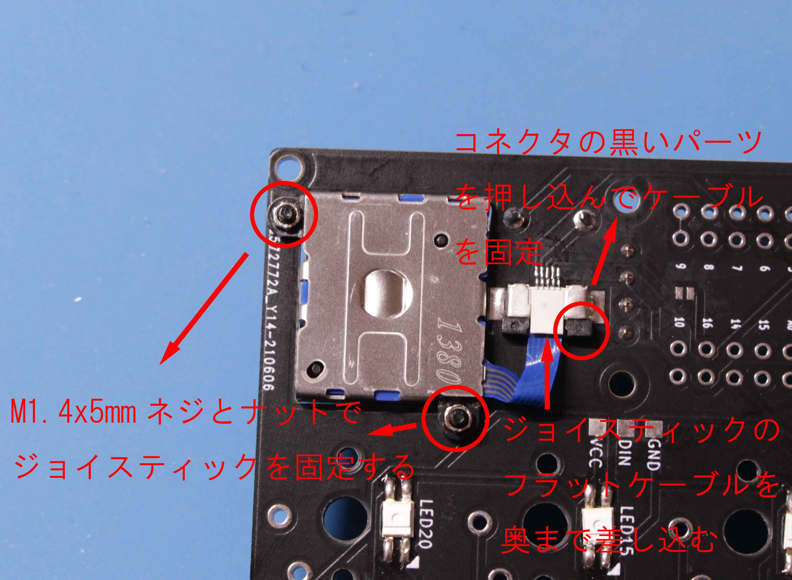

M1.4x5mmねじとナットでジョイスティックを固定します。(2か所）  
基板裏面のコネクタにジョイスティックのフラットケーブルを奥まで差し込んだら、コネクタの黒い部品を押し込んでケーブルを固定します。  
 
 
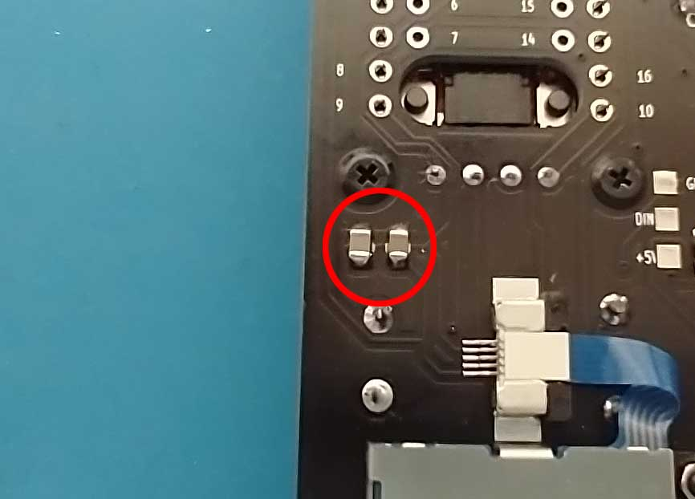

RP2040使用時などでアナログスティックのセンターが若干不安定になる時は、赤丸部分2か所に0.1μFのパスコンを追加してください。 
 
 
 

### ４．リセット・レイヤースイッチ、OLEDソケットはんだ付け

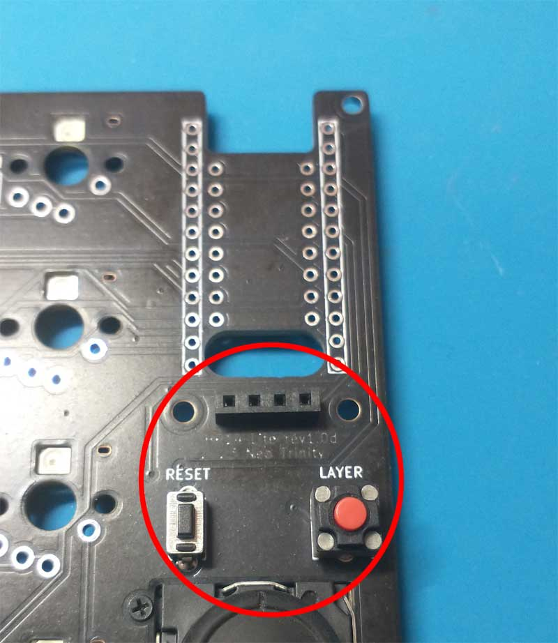

リセットスイッチ、レイヤースイッチ、OLEDソケットを表面に差し込み、裏側をはんだ付けします。   
 
 
 

### ５．ProMicroの組み立て

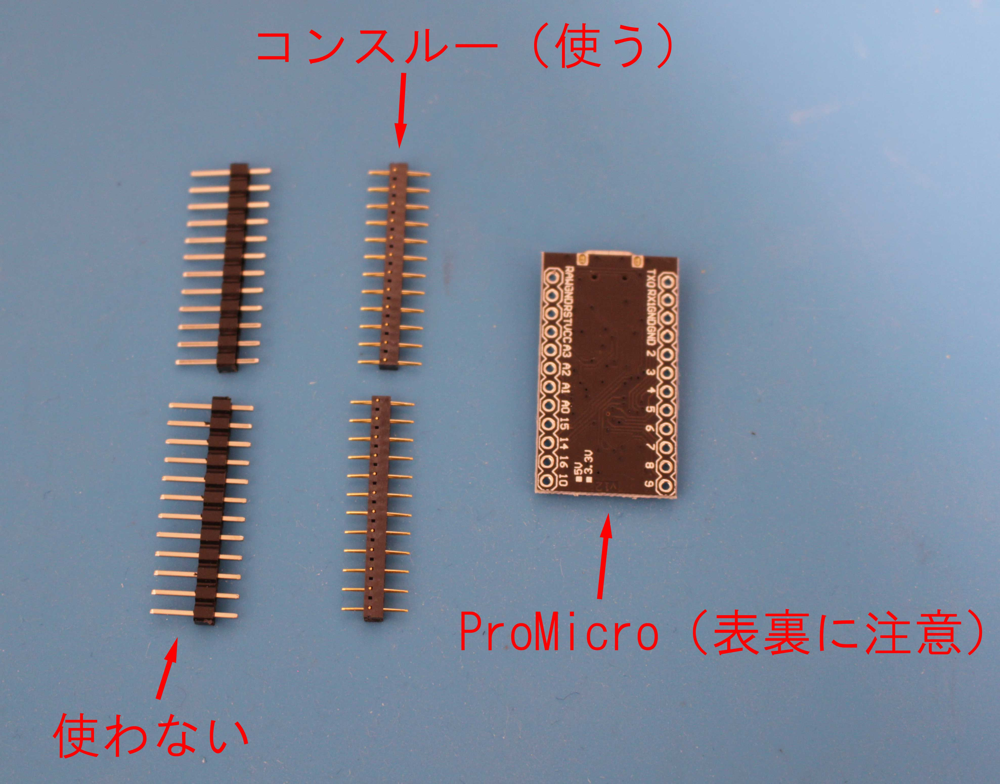

ProMicroはピンが同梱している場合も多いですが、本キットはコンスルー使用を推奨します。
コンスルーとは基板とProMicroを脱着可能にするスプリングピンです。

ProMicroは初期不良やUSB端子がモゲたり壊れることがあり、ProMicro交換時に作業がやりやすくなるようコンスル―を使用します。    
 
 
 

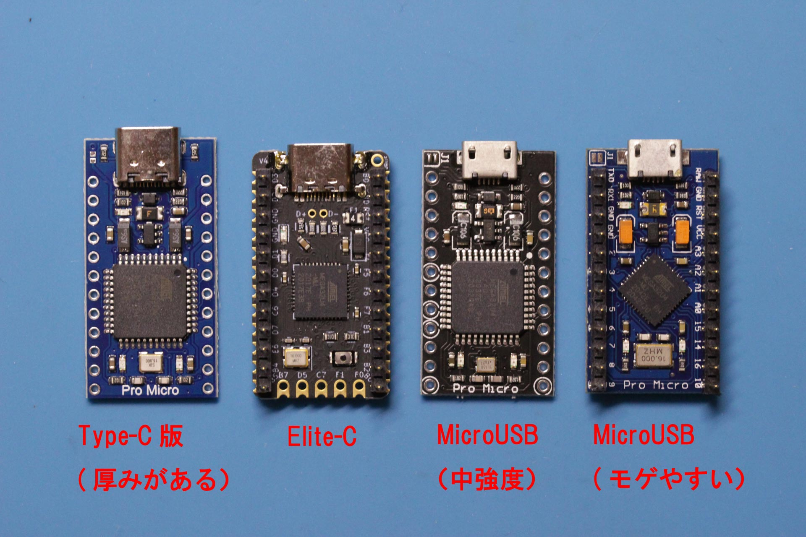

ATmega32U4搭載のProMicro。  
USB-Type-Cコネクタ付きがおすすめです。

 
 
 

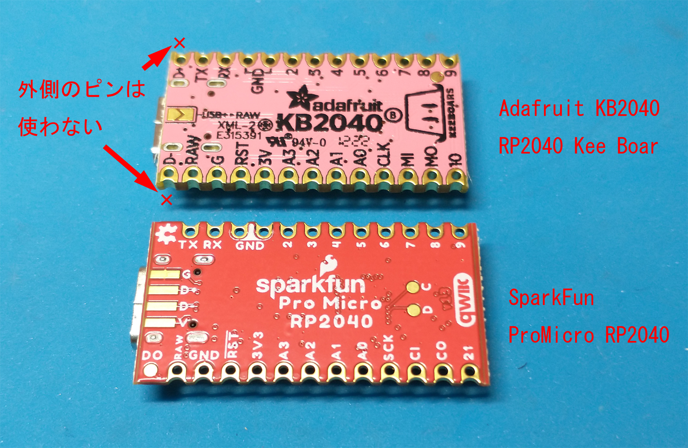

LHP14Lite rev1.0d対応のRP2040搭載のProMicro。  
上段が13ピン×2列のAdafruitKB2040、下段が12ピン×2列のSparkFunRP2040です。  
AdafruitKB2040使用時は外側2本のピンは使用しません。
 
 
 

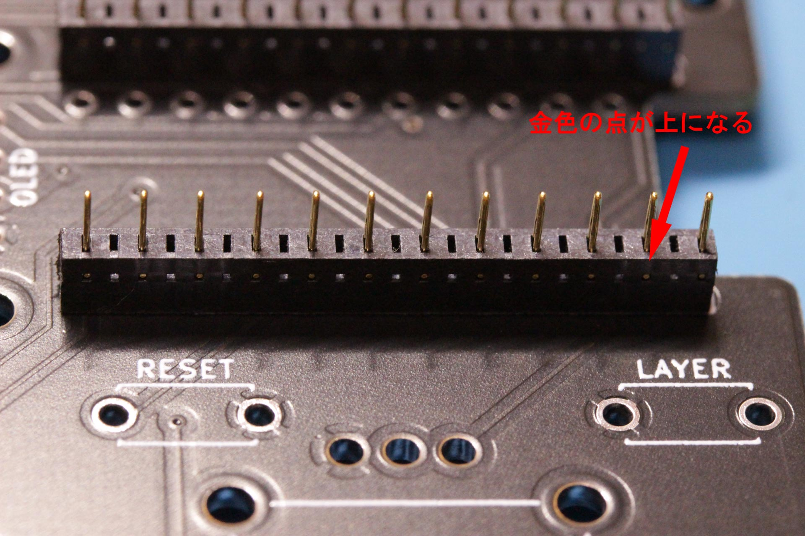   
 
 
 

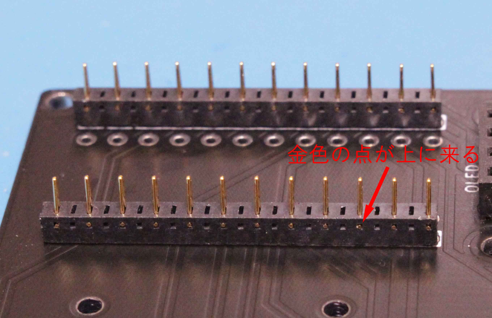

基板の表面にコンスルーを手で差し込みます。**（絶対に基板にはんだ付けしないでください）**  
コンスルーの取り付けにも向きがあります。金色の点が上になるようセットします。
向きも同じになるようにします  
 
 
 

コンスルーとProMicroをはんだ付けします。Promicroは部品がついていない面を上にします。  
最初に1か所だけはんだ付けして、ProMicroに浮きがないかチェックして残りのピンをはんだ付けしましょう。  
 
 
 
 
 

### ６．OLEDの取り付け

OLEDソケットにピンを差し込みます。  
 
 
 

OLEDをピンにはんだ付けします。  
OLEDはとても角度がズレやすいので、4ピンを一気にはんだ付けせず、まずは1か所ハンダ付けします。  
もしOLEDがズレているようでしたら、はんだを溶かし直して位置を調整します。  
位置がOKでしたら残りの3ピンをはんだ付けします。  
 
 
 
 
 

### ７．スイッチの取り付け

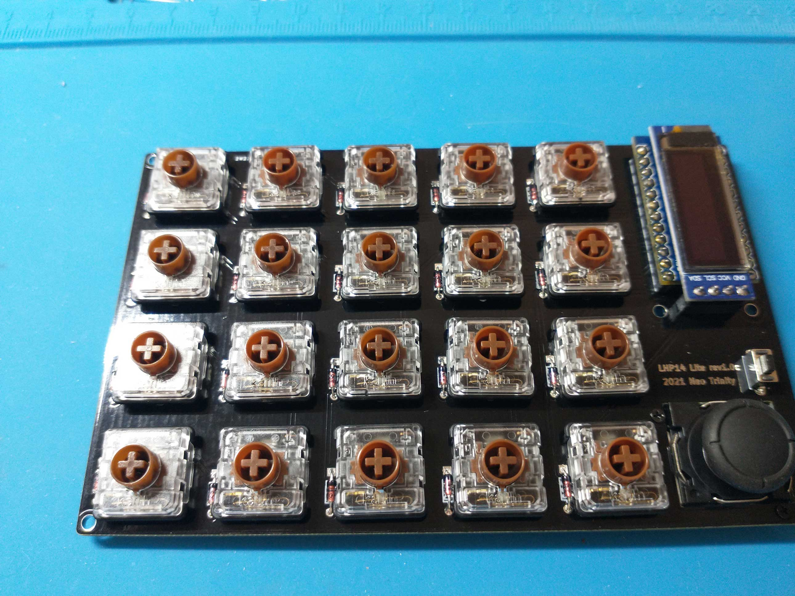

基板にスイッチをはんだ付けします。  
本機はChoc V2、V1対応です。写真のようにV2を使用した時はCherryMX用のキーキャップが使用可能です。  
ChocV1をお使いの場合は、V1専用のキーキャップをお使いください。  
 
 

 

### ８．ベースプレート取り付け

基板のカド4か所に六角(丸)スペーサーM2xL3.5mmをスリムヘッド小ねじ M2x3mmでねじ止めします。  
 
 
 

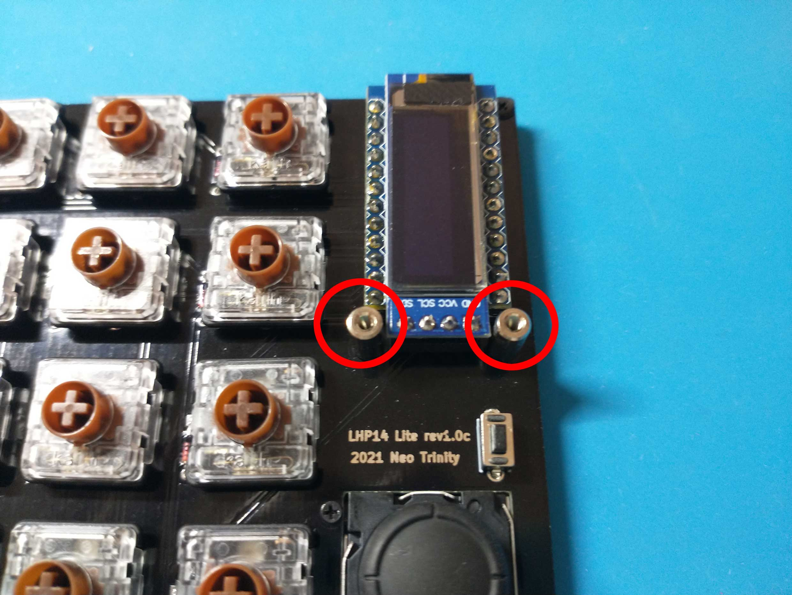

六角(丸)スペーサーM2xL9mm　2個をスリムヘッド小ねじ M2x3mmで裏面からねじ止めします。  
 
 
 

ベースプレートをスリムヘッド小ねじ M2x3mmでねじ止めします。  
 
 
 

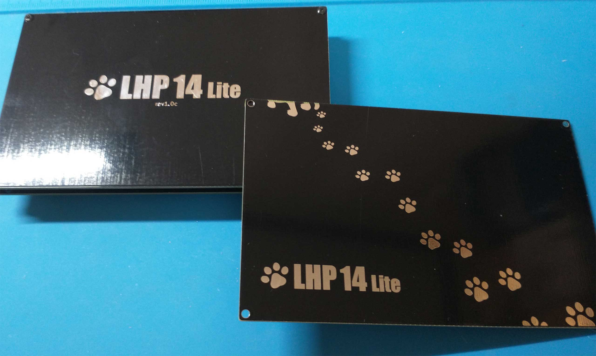

ベースプレートはリバーシブルデザインです。お好きな面をお選びください(´∀｀)  
 
 
 

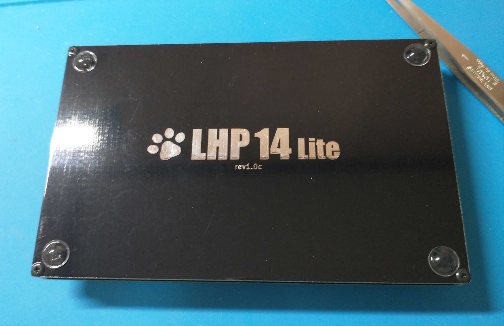

4隅に滑り止めのウレタンクッションを貼り付けます。 
 
 
 

### ９．完成

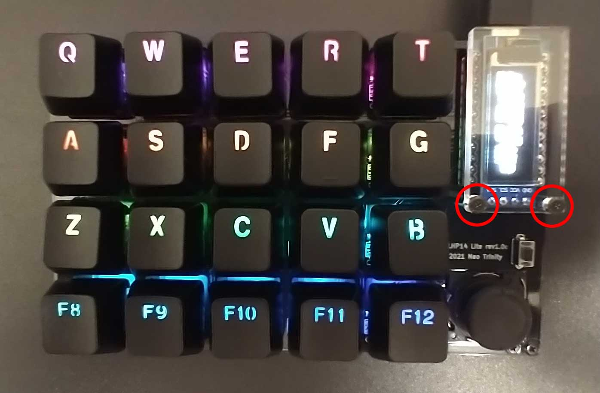

スリムヘッド小ねじ M2x5mm 2本でOLEDシールドのアクリル板を取り付けます。  
好みのキーキャップを取り付けたら完成です！  
 
 

### **お疲れ様でした。**

 
 

[ ＞＞動作テスト](./LHP14Lite_d_hardware_test_1.md/) 
