# LHP14　ビルドガイド

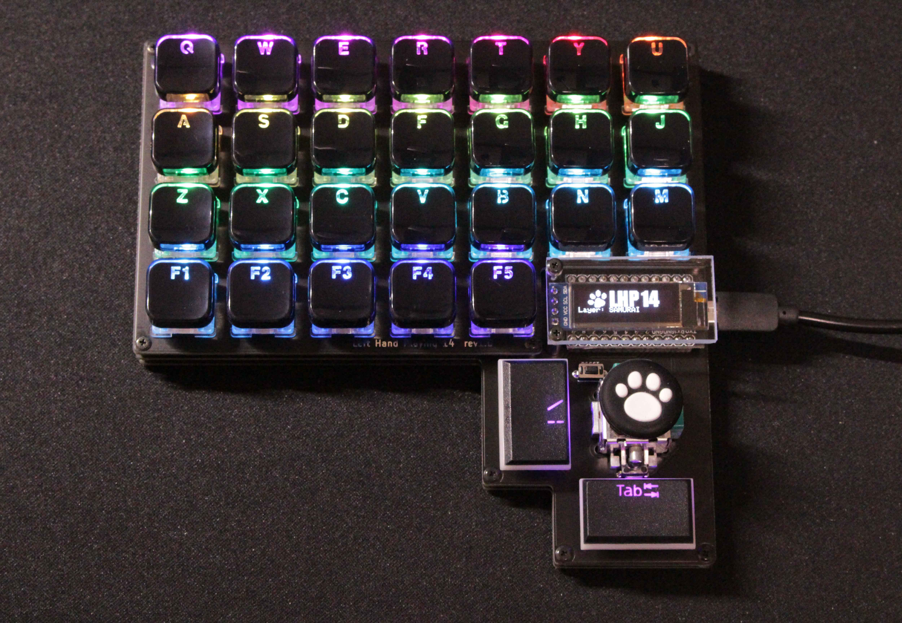  
 
 
 
 

## はじめに

アナログジョイスティック付き左手デバイス『**LHP14**』のビルドガイドです。  
（LHP=Left Hand Playing。ライトハンド奏法(=Right Hand Playing)にあやかって命名しました）

最近のアナログスティック付きデバイス入手難に際し、お困りの方々へ少しでも支援になればと開発しました。  
ハンダ付け初心者の方にも組み立てられるよう、設計段階で色々工夫しました。  
もしかしてビルドガイドを見て不安になった貴方。実際に作ってみると案外難しくないかもです。（たぶん極とか零式以下の難易度です:-）  
### **Let's do it!**
 
 
 
 

## キット内容

・本体基板3枚（ベース、メイン基板、キースイッチプレート）

・アナログジョイスティック　(ALPS ALPINE　**RKJXK122400Y**)

・Kailh ChocV1 ロープロファイルスイッチ(リニア=赤軸)　2個

・丸スペーサーM2xL3.5mm　13個

・六角スペーサーM2xL10mm　2個 (rev 0.9)  
　丸スペーサー　M2xL10mm　2個 (rev 1.0)

・スリムヘッド小ねじ M2x8mm 三価黒クロメート　5個

・スリムヘッド小ねじ M2x5mm 三価黒クロメート　2個

・スリムヘッド小ねじ M2x3mm 三価黒クロメート　13個

・リードタイプダイオード1N4148　28個+予備

・タクタイルスイッチ（リセット用）

・アナログスティック用サムパッド取付部品　1個+予備

・OLEDシールド用アクリル板

・脚用ウレタンクッション　4個  
 
 
 
 

## キット以外に必要な部品

・Pro Micro （コンスルー付き）　
※最近発売されている厚みのあるType-C ProMicroをお使いの際は高さ3.5mmの12Pinコンスル―をご使用ください。　
(その際、OLEDのソケット差し込み深さは少し浅くなる場合があります。)
MicroUSBタイプ、Elite-C、薄型のType-C ProMicroは2.5mmの12Pinコンスル―でOKです。

・OLEDモジュール （ピンソケット付き）

・Cherry MX互換スイッチ　26個

・Cherry MX互換スイッチ用のキーキャップ　26個

・Choc V1ロープロスイッチ用のキーキャップ1.5U　2個

・ジョイコン用サムパッドカバー

・Micro USB ケーブル

#### オプション

・発光ダイオード　YS-SK6812MINI-E　28個

もしくは

・フルカラーシリアルLEDテープ 6個タイプ

※上記は同時使用はできません。製作時にYS-SK6812MINI-Eを使うか、LEDテープで行くか決めてからパーツを集めてください。  
YS-SK6812MINI-Eを使う方が難しいですが、見栄えはこちらが優れていると思います。

※これらは[**遊舎工房**](https://shop.yushakobo.jp/)や[**TALP KEYBOARD**](https://talpkeyboard.net/)、amazonなどで購入可能です    
 
 
 
 

## 必要な工具・材料

・はんだごて（温度調整式を推奨）

・はんだ（出来るだけ細いもの。0.6mmと0.3mmがあればgood）

・こて先クリーナー

・はんだ吸取線（はんだ付けを失敗した時などに使用）

・フラックス（はんだ付けする部品に塗布するとハンダ付けが容易になります）

・フラックスクリーナーと綿棒（余分なフラックスを掃除するとき使用）

・精密ドライバー（+）

・ニッパー（ダイオードのリード（足）や使用済み吸取線をカット）

・マスキングテープ（ダイオードなど仮固定用）  
 
 
 
 

## 作り方

#### ※電子部品の多くは取り付ける向きがあります。逆に取り付けると動かなかったり壊れたりします！

#### ※基板にも表裏があります。表に取り付ける部品、裏に付ける部品がありますので注意！

#### ※電子部品（特にLED）は熱に弱いので素早くはんだ付けしましょう！

#### ※複数個所をはんだ付けする部品は、まず1か所目のはんだ付けが終わったら、向きや部品の浮きなどをチェックしてください。はんだ付けが1か所であれば、リカバリは容易です。   

 
 
 
 

### １．ダイオードのはんだ付け

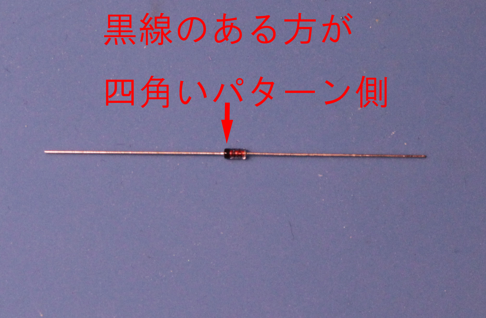

ダイオードをはんだ付けします。ダイオードには極性（取付方向）があるので、ダイオードについている黒線を目印にします。  
 
 
 

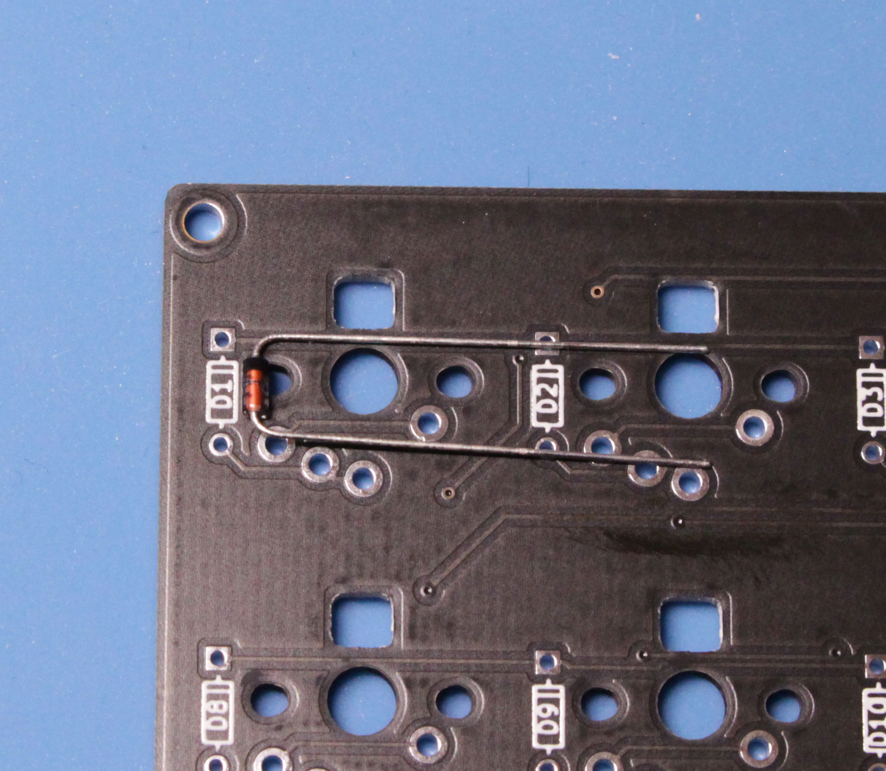

ダイオードを基板の表面D1～D28にはんだ付けします。足をコの字に曲げて、基板の表面にセットして裏をはんだ付けします。向きはシルク印刷を参考にセットします。（黒線側が四角いパターンになる）    
 
 
 

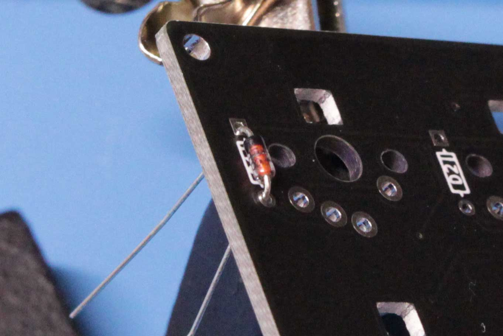

ダイオードを基板にセット。  
 
 
 

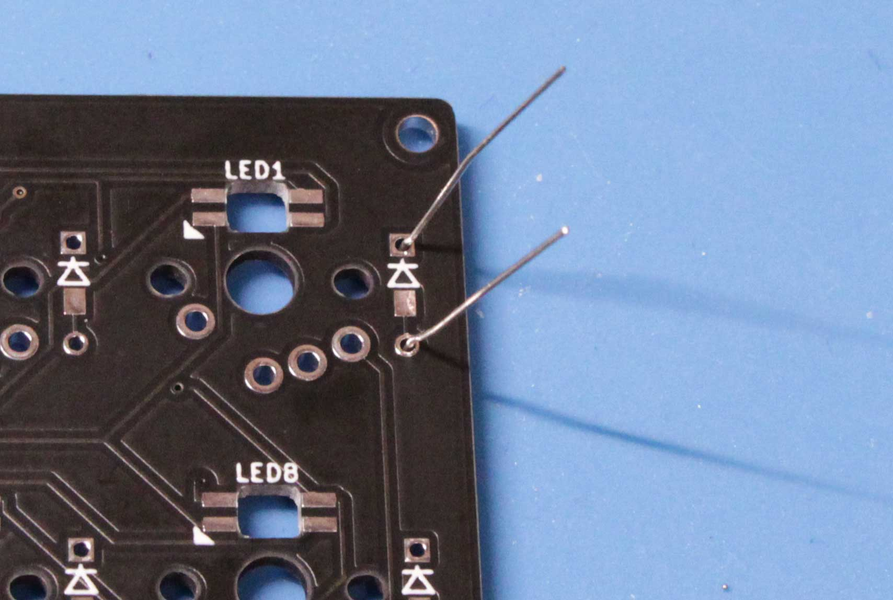

裏から見たところ。
足を1.5mm程度残してカットした後、はんだ付けしていきます。    
 
 
 

ダイオードを1行ごとにセットしたらマスキングテープで固定すると作業中に外れずに作業しやすくなると思います。    
 
 
 

はんだ付けが終わったら、念のためダイオードの向きが正しいかどうかチェックしましょう。  
 
 
 

### ２．ProMicroの組み立て

コンスル―付きのProMicroにはピンが別に付いている場合が多いですが、今回はコンスルーを使用します。
コンスルーとは基板とProMicroを脱着可能にするスプリングピンです。（ProMicroはUSB端子が取れたりとか意外と壊れることが多いのです；；）    
 
 
 

基板の表面にコンスルーを手で差し込みます。**（絶対に基板にはんだ付けしないでください）**  
 
 
 
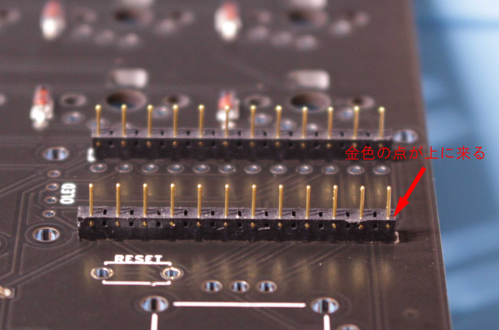

コンスルーの取り付けにも向きがあります。金色の点が上になるようセットします。
向きも同じになるようにします  
 
 
 

コンスルーにProMicroを写真の向きで差し込みます。ProMicroは部品が付いていない方が表になります。  
 
 
 

コンスルーとProMicroをはんだ付けします。最初に1か所だけはんだ付けして、ProMicroに浮きがないかチェックして残りのピンをはんだ付けしましょう。  
 
 
 
 
 

### ３．リセットスイッチ、OLEDの取り付け

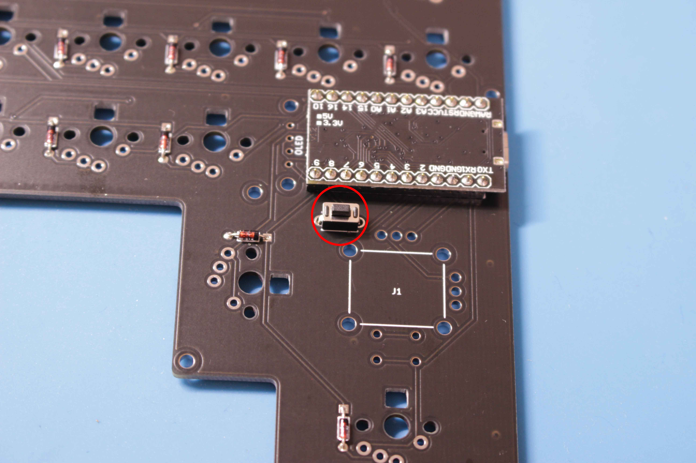

リセットスイッチを基板表面に差し込み、裏側をはんだ付けします。この部品には極性はありません。  
 
 
 

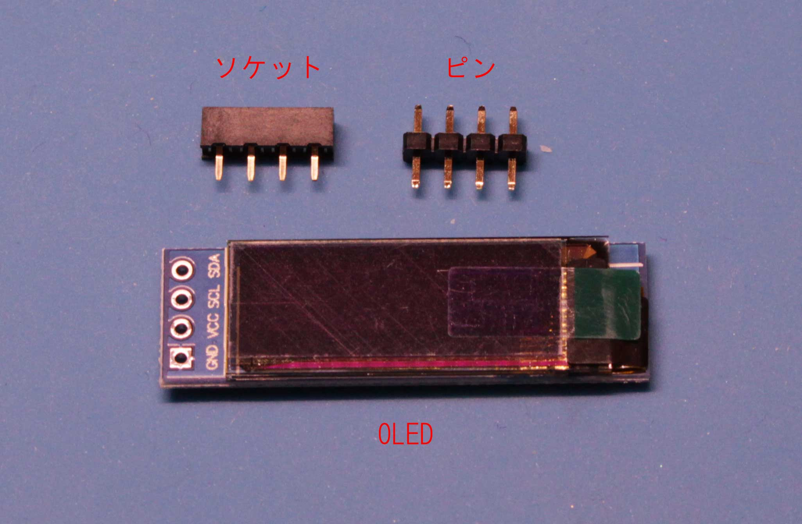

OLEDと取付用のソケット、ピン  
 
 
 

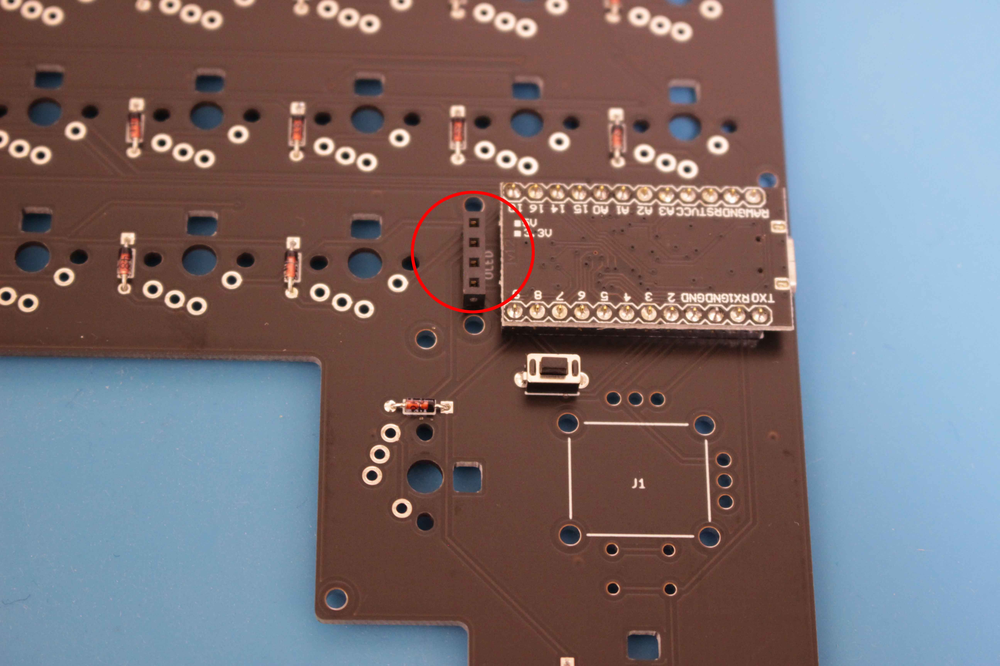

OLED取付用のソケットを表面に差し込み、裏面をはんだ付けします。こちらも極性はありません。  
 
 
 

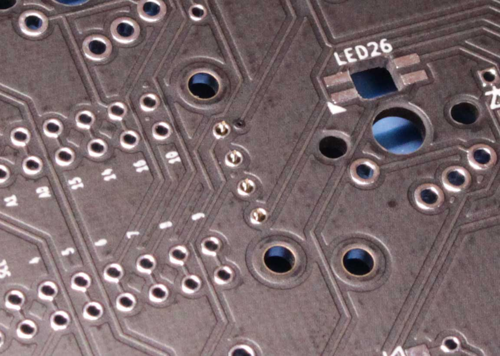

裏面をはんだ付け。  
 
 
 

OLEDソケットにピンを差し込みます。  
 
 
 

OLEDをピンにはんだ付けします。  
OLEDはとても角度がズレやすいので、4ピンを一気にはんだ付けせず、まずは1か所ハンダ付けします。  
もしOLEDがズレているようでしたら、はんだを溶かし直して位置を調整します。  
位置がOKでしたら残りの3ピンをはんだ付けします。  
 
 
 
 
 

### ４．LEDのはんだ付け（オプション）

本機はYS-SK6812MINI-Eのはんだ付けを推奨しておりますが、LEDは熱に弱くはんだ付けの難易度が比較的高いので、作業難易度が低いLEDテープを使うことも出来るよう設計しました。  
ただ、LEDテープを使ったアンダーグロー照明はアクリル板のベースを使ったときにより一層効果を発揮する方法なので、本機のような光を裏面に透過しないキーボードの場合は光り方が弱くなってしまいます；；  
**注意！！！   YS-SK6812MINI-EとLEDテープの同時使用はできません。**  
 
 
 
 
 

#### ・LEDテープを使う方法

基板裏面の「GND」「DIN」「+5V」と書かれた端子にLEDテープをセットして、それぞれ対応する端子を写真のようにはんだ付けするだけです。  
 
 
 

#### ・YS-SK6812MINI-Eを使う方法

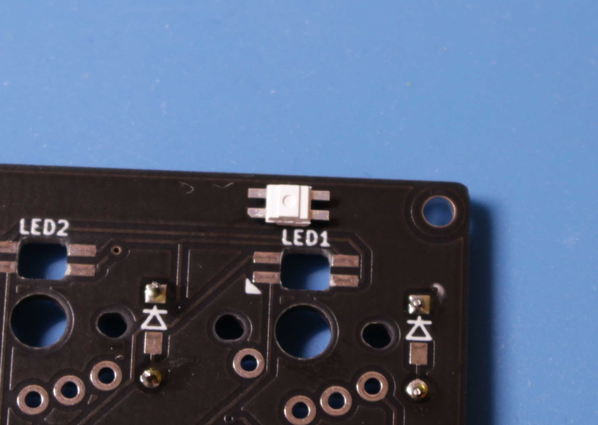

基板の裏面から、LED取付穴にYS-SK6812MINI-Eをはめ込んで足をはんだ付けしていきます。  
LEDは極度に熱に弱いので、温度調整式のはんだごてを使い、270度以下の出来るだけ低温で作業するとトラブルが起こりずらくなります。  
フラックスや細いはんだを使うことも推奨です。  
 
 
 

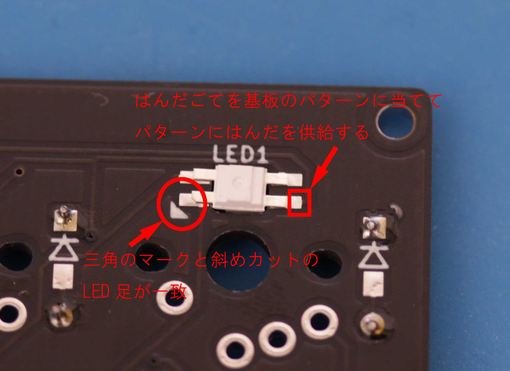

LEDには極性があります。4本のLED足の内、斜めにカットされた足が三角のマークにくるようセットします。  
はんだ付けはこて先をLED足に出来るだけ触れさせないようにします。  
フラックスを塗ったら、こて先で基板の銀色のパターンを温め、そこにはんだを流し込むと毛細管現象で溶けたハンダがLED足の方に流れ込むと思います。  
 
 
 

あと2つでゴール。
がーんばれ、がーんばれッ！  
 
 
 

28個のLEDをはんだ付け終わったら、ここで[ファームを焼いてテスト](./LHP14_hardware_test.md/) してみても良いと思います。  
はんだ付けが成功していればLEDが全て光るはずです。  
 
でも、LEDが点灯しなくても大丈夫！  
この場合、LEDが破壊されているよりもはんだが上手く回っていないことが多いです。  
点灯していないLEDか、その1つ前のLEDのはんだを軽く溶かし直してみて下さい。  
 
 
 
 
 

### ５．スイッチの取り付け

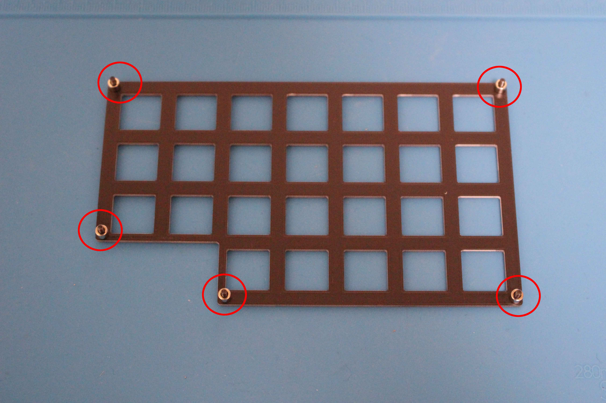

スリムヘッド小ねじ M2x8mmを5本、丸スペーサーM2×L3.5mmを5個、写真のようにキープレートにねじ止めします。  
 
 
 

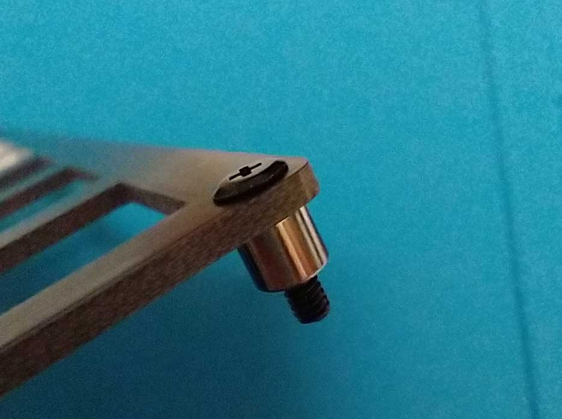

上記作業の拡大写真。8mmネジと3.5mmスペーサーでキープレートを挟みます。
 
 
 

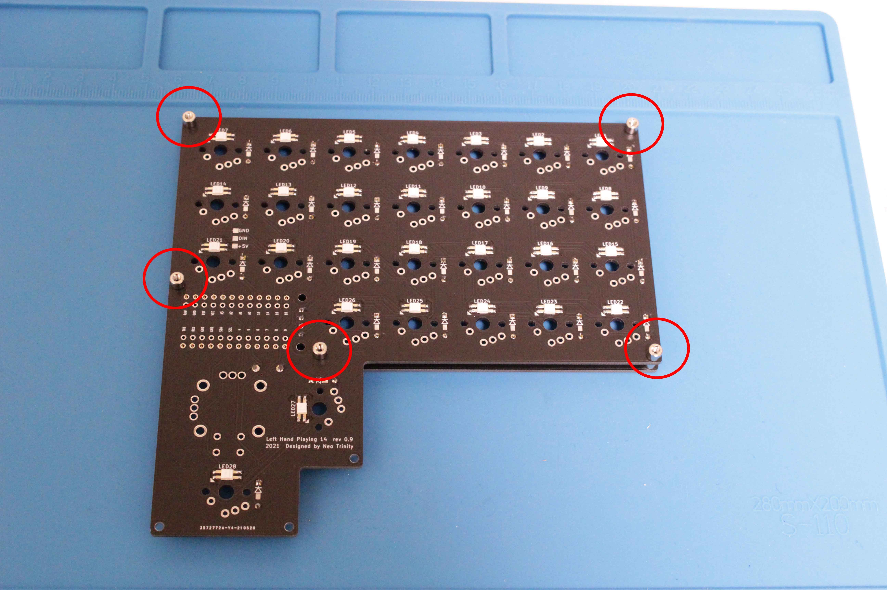

さらに丸スペーサーM2×L3.5mmを5個使って、基板とキープレートを合体させます。  
 
 
 

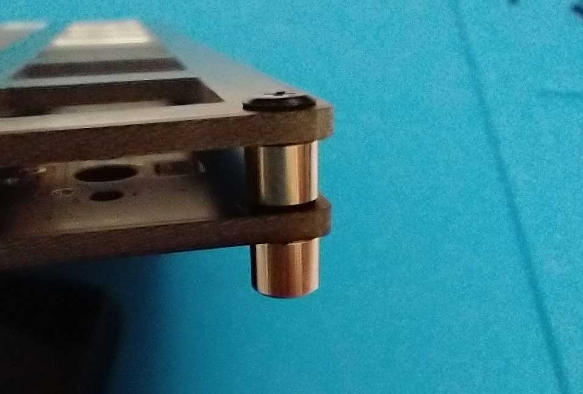

上記作業の拡大写真。3.5mmスペーサーで基盤を挟みます。
 
 
 

こんな感じに組み立てます（写真撮るの忘れたので、素の基盤を使って再現しましたw）  
 
 
 

スイッチを穴に差し込んでいきます。  
この時、スイッチの足が曲がることがあるので、差し込む前にスイッチの足が真っすぐかどうかチェックしながら作業します。  
 
 
 

LED照明をつけた場合、スイッチは透明のものを使うと光が綺麗に回ると思います。  
 
 
 

スイッチをはんだ付けする時も、2か所をはんだ付けせずに1か所のみはんだ付けしてスイッチの浮き、足折れがないかチェックします。  
 
 
 

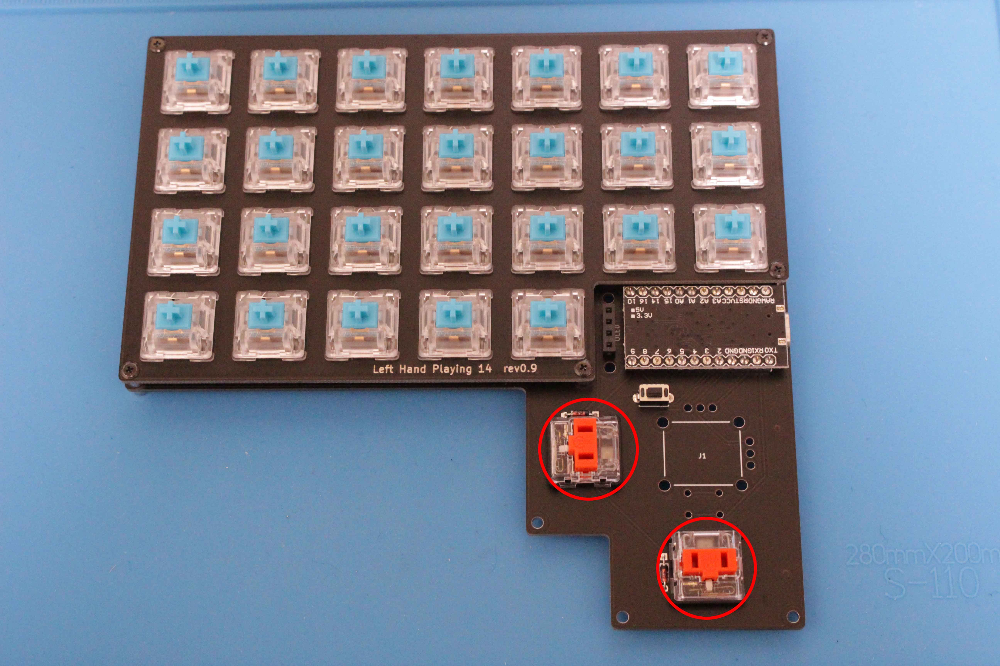

ジョイスティック周りの2キーはキットに付属のChocロープロファイルスイッチ指定です。  
（高いとジョイスティックの動きに干渉するため）  
 
 
 

#### TIPS

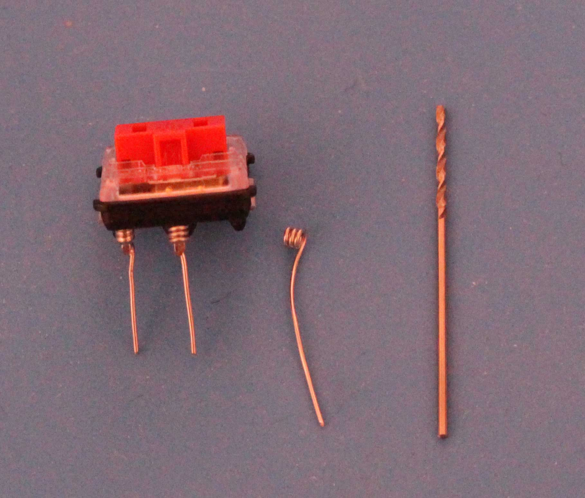

私の作例写真で、メイン部分にMX互換スイッチとChocスイッチが混在していることがありますが、Chocスイッチの足が基板まで届かないので足を延長しております。  
ドリルなど細いものにスズメッキ線を巻き付けて、ループとChoc足をはんだ付けしております。  
 
 
 
 
 

### ６．OLEDシールド用スペーサーの取り付け

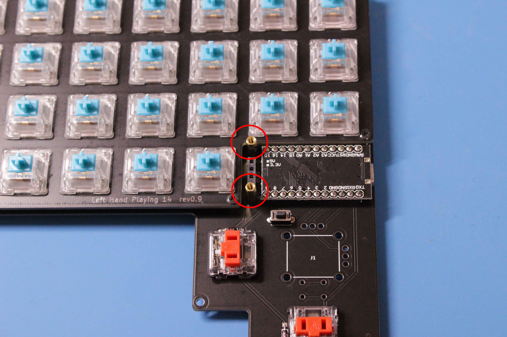

六角(丸)スペーサーM2xL10mm　2個をスリムヘッド小ねじ M2x3mmでねじ止めします。  

 
 

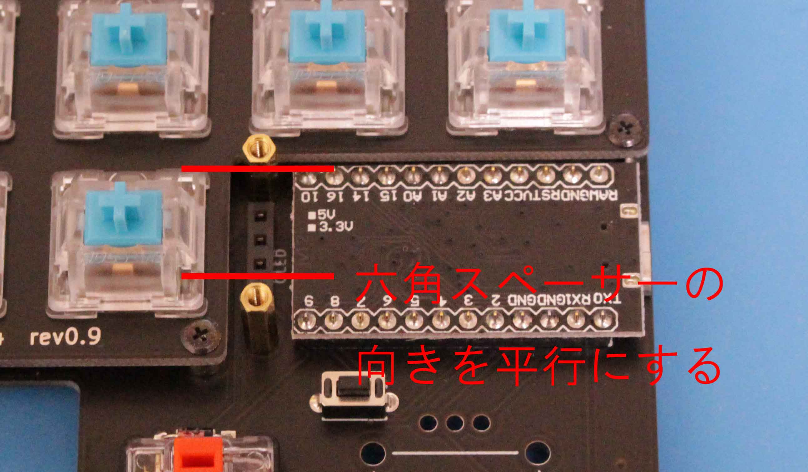
OLEDと六角スペーサーの間隔がギリギリなので、隙間を確保するためにスペーサの面を平行にします。（rev 0.9のみ）

 
 
 
 
 

### ７．ジョイスティックの取り付け

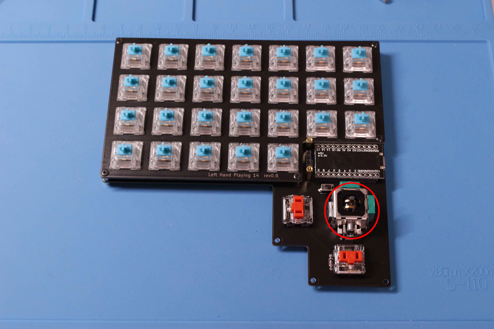

今回、指定部品としてテストで特性が安定していたALPSのRKJXK122400Yを付属しました。  
とはいえ、アナログスティックは消耗が激しい部品なので、ジョイスティック部分は大きめの穴を開けて、将来のスティック交換が容易になるよう工夫しております。  
（経験上、ジョイスティックは数千時間のプレイで不安定になることが多いです）  
 
 
 

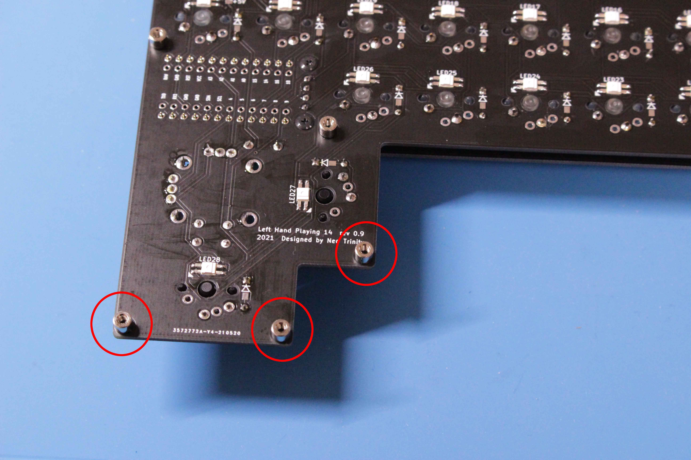

ジョイスティックをはんだ付けしたら、丸スペーサーM2xL3.5mm3個をスリムヘッド小ねじ M2x３でねじ止めします。  
 
 
 

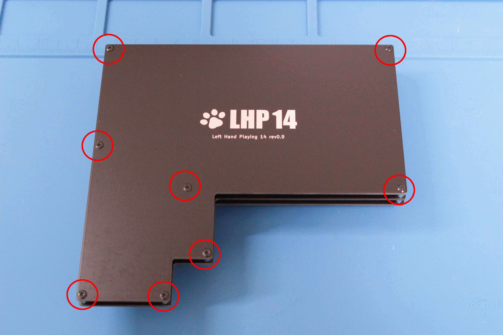

スリムヘッド小ねじ M2x3mm　8本でベースプレートを本体にねじ止めします。  
 
 
 
 
 

### ８．完成

スリムヘッド小ねじ M2x5mm 2本でOLEDシールドのアクリル板を取り付けます。  
ジョイスティックにアナログスティック用サムパッド取付部品を押し込みます。  
緩い場合は接着剤（SuperXなどは弱いです。[メタルロック](https://www.cemedine.co.jp/home/adhesive/acrylic/metallock.html)が高強度です）を使ってください。  
 
 
 

裏面に滑り止めの脚用ウレタンクッション　4個を張り付けます。  
 
 
 

好みのキーキャップ、サムパッドカバーを取り付けたら完成です！  
 
 

### **お疲れ様でした。Good game!**

 
 

[ ＞＞動作テスト](./LHP14_hardware_test.md/) 

