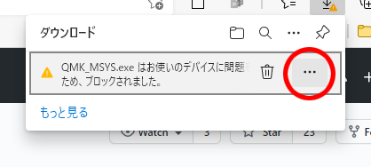
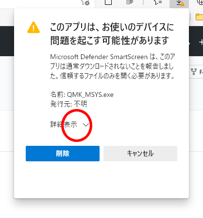
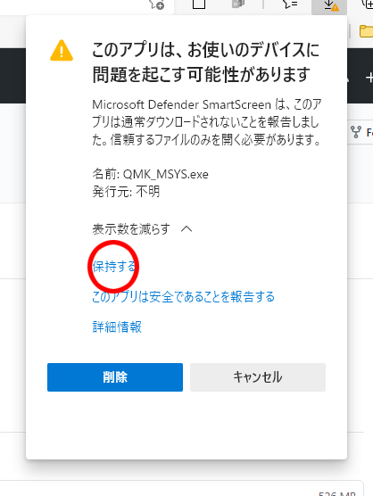
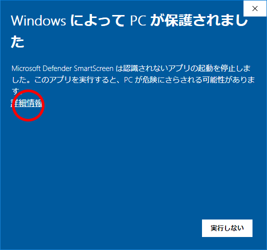
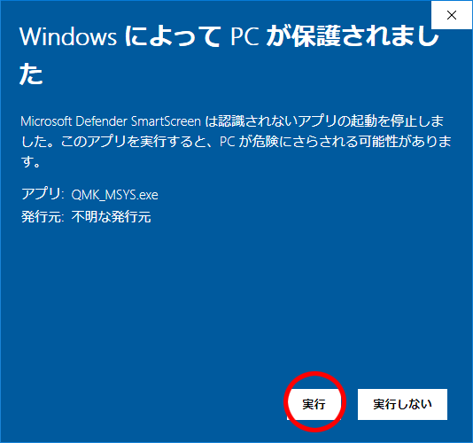
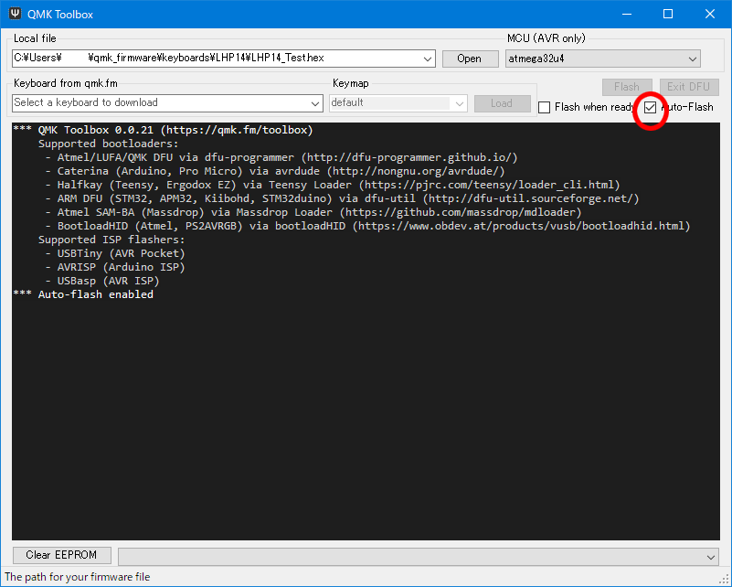
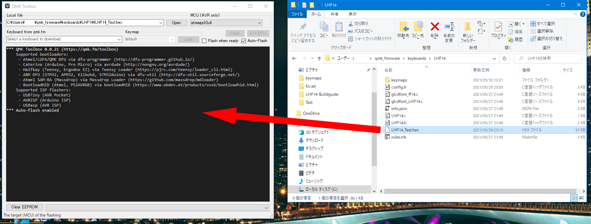
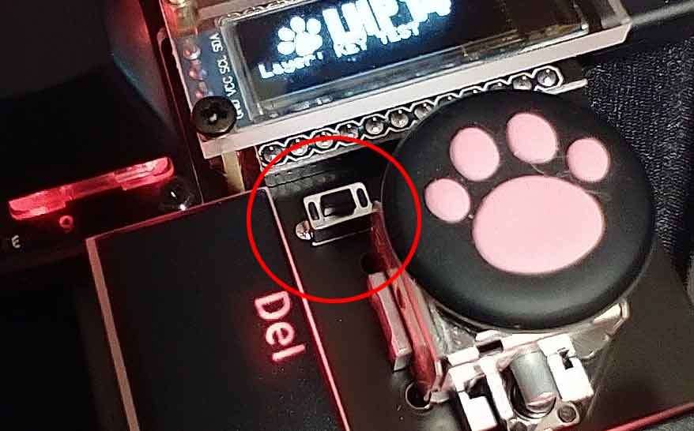
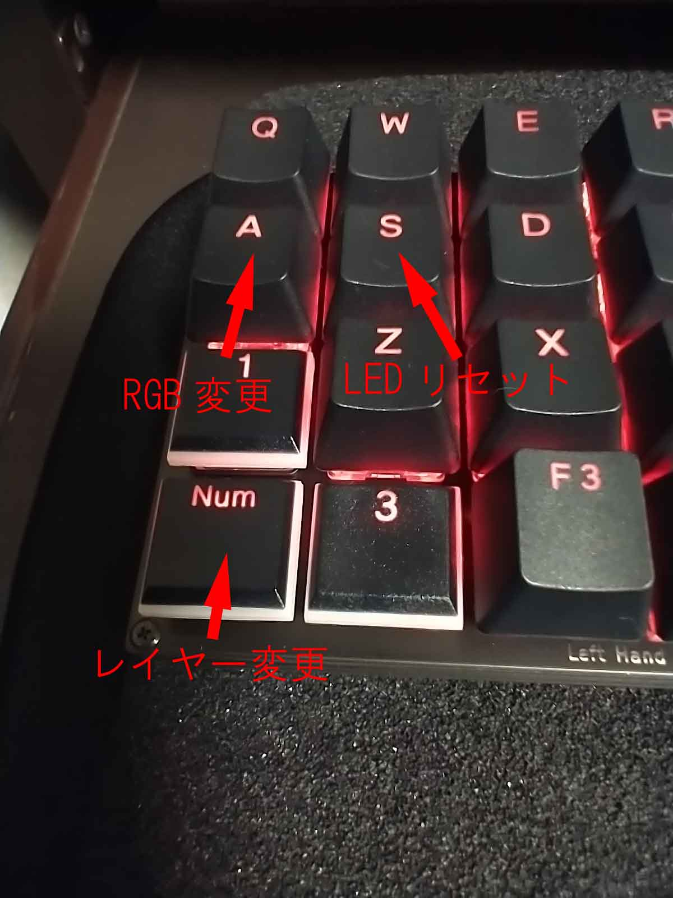

# 動作テスト
LHP14はQMK firmwareという、キーボード用のオープンソースファームウェアで動作します。  
私はwindows10でQMK MSYSとQMK Toolboxを使っておりますので、こちらを使った手順で説明します。
 
 
 

### １．QMK-MSYSのセットアップ

・[公式サイト](https://msys.qmk.fm/)からLatest versionのQMK_MSYS.exeをダウンロードします。

ダウンロード時、警告のメッセージが出ますが、赤丸部分をクリックしてダウンロードします。
 
 
 
・ダウンロードしたQMK_MSYS.exeを実行します。

警告が出ますが、インストールを進めていきます。
 
 
 

・QMK MSYSを起動します。   
　黒い画面が開き、＄が出たら、qmk setupと打ち込み、エンターを押します。

・設問が出ますが全てy(es)で答えます。

・cloning into...　と出てファイルのアップデートが始まりますが、終わるまで待ちます。

・QMK is ready to goと出て、＄の横にカーソルが出てきたらQMK MSYSセットアップ完了です！
 
 
 

### ２．QMK Toolboxのインストール

・[公式サイト](https://github.com/qmk/qmk_toolbox/releases)からqmk_toolbox_install.exeをダウンロードし実行します。  
同じように警告が出ますが、インストールを進めていきます。
 
 
 
### ３．テストファームの書き込み

・[LHP14ファームウェア置き場](https://github.com/NeoTrinity-FF14/LHP14-firmware)からLHP14のファームウェアをダウンロードします。  
　Codeと書いた緑のボタンを押し、Zipファイルをダウンロード、解凍します。

・C:\Users\ユーザー名\qmk_firmware\keyboards\に、LHP14フォルダをフォルダごとコピーしてください。

・QMK Toolboxを起動します。

・右上にあるAuto-Flashをチェックします。

 
 

・LHP14フォルダ内のLHP14_Test.hexをQMK Toolboxにドラッグ＆ドロップします。

 
 

・PCにLHP14をつなぎ、LHP14のリセットボタンを押すとファームウェアが書き込まれます。

 
 
 

### 4．動作テスト

・テストファームを書き込むとOLEDが光り、LEDが赤く光ります。

・OLEDの表示が「KEY TEST」になっていることを確認します。 キーを押して、文字が出てくれば正常。

・レイヤー変更キー（4行1列目）を押し、RGB LED TESTに切り替えてください。RGB変更（2行1列目）を押すとLEDの発光パターンが切り替わっていきます。LEDリセット（2行2列目）でLEDをリセットして全て赤に変わります。

・各キーの詳しい割り当ては\LHP14\keymaps\Test\のkeymap.cを参照してください。

 
 
 

・windowsコントロールパネル→ハードウェアとサウンド→デバイスとプリンタ→LHP14を右クリックでゲームコントローラーの設定→LHP14のプロパティでジョイスティックのテスト。ジョイスティック押し下げでボタン1が反応すればOK。
 
 

### お疲れ様でした。上手く動きましたか？？　

 
 

[ ＞＞キーマップを作る](./LHP14_make_layer.md/) 

