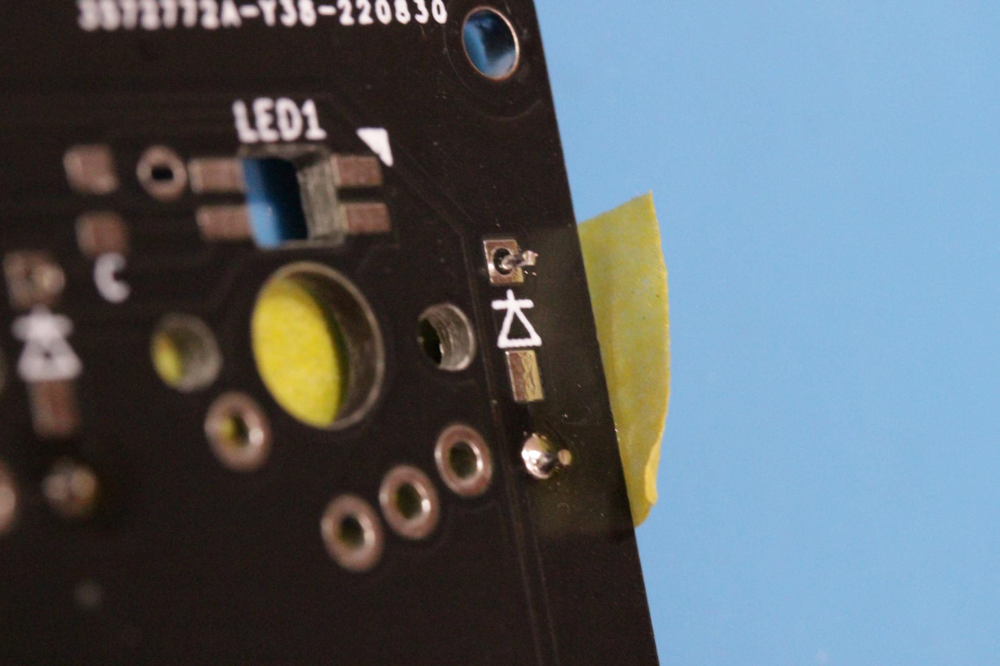

# LHP14 rev 1.0f　ビルドガイド

  
 
 
 

## はじめに

アナログジョイスティック付き左手デバイス『**LHP14 rev1.0f**』のビルドガイドです。  
（LHP=Left Hand Playing。ライトハンド奏法(=Right Hand Playing)にあやかって命名しました）

最近のアナログスティック付きデバイス入手難に際し、お困りの方々へ少しでも支援になればと開発しました。  
ハンダ付け初心者の方にも組み立てられるよう、設計段階で色々工夫しました。   

もしかしてビルドガイドを見て不安になった貴方。実際に作ってみると案外難しくないかもです。（たぶん極とか零式以下の難易度です:-）  

## 前バージョンからの変更点

・レイヤー(ジョブプロファイル）切り替え用タクトスイッチを新設しました。（戦闘中のレイヤー変更誤爆がなくなるはずw）

・タクトスイッチを含めて、全30キーにキーアサイン割り当て可能

・基盤の外形変更により、高さ2.0mm～3.5mmのコンスルーが使用可能になりました。（コネクター部に厚みのあるType-C版ProMicroでも、ポピュラーな2.5mmコンスル―が使用可能です）

・付属のChocスイッチをV2に変更（CherryMX対応キーキャップが使用可能）

・新しいファームをお使いください。(QMK ver 0.18.5にて動作確認しております。古いバージョンのQMKではビルドできません。新ファームは32ジョブ分までのレイヤーが使用可能です)

[**前バージョンのビルドガイドはこちら**](./LHP14c_buildguide.md/)

 
 
 
 

## キット内容

・本体基板3枚（ベース、メイン基板、キースイッチプレート）

・アナログジョイスティック　(ALPS ALPINE　**RKJXK122400Y**)

・Kailh ChocV2 ロープロファイルスイッチ　2個

・丸スペーサーM2xL3.5mm　13個

・丸スペーサー　M2xL9mm　2個

・スリムヘッド小ねじ M2x8mm Black　5個

・スリムヘッド小ねじ M2x5mm Black　2個

・スリムヘッド小ねじ M2x3mm Black　13個

・リードタイプダイオード1N4148　28個+予備

・タクタイルスイッチ　2個+Kailhミュートスイッチ　1個

・アナログスティック用サムパッド取付部品　1個+予備

・OLEDシールド用アクリル板

・脚用ウレタンクッション　4個  

・2012サイズのチップコンデンサ　0.1μＦ　28個+予備

 
 
 
 

## キット以外に必要な部品

・Pro Micro  

・コンスル―　2個（12ピン、高さ2.0～3.5mmまで使用可能）

・OLEDモジュール （ピンソケット付き）

・Cherry MX互換スイッチ　26個

・Cherry MX互換スイッチ用の1Uキーキャップ　26個と1.5Uキーキャップ2個
（1U=通常サイズ。1.5U=TABキー、US配列の\キーなど。　CherryMX用USキーキャップセットを購入すれば必要数が揃います。[（こちらはとても安価）](https://shop.yushakobo.jp/collections/keycaps/products/a0300pc-01-1)）

・ジョイコン用サムパッドカバー[（おすすめ）](https://www.amazon.co.jp/CYBER-アナログスティックカバー-ねこにゃん-SWITCH-Joy/dp/B0749S6P99/)

・USB ケーブル

#### オプション

・発光ダイオード　SK6812MINI-E　28個  

もしくは

・フルカラーシリアルLEDテープ 6個タイプ

※上記は同時使用はできません。製作時にSK6812MINI-Eを使うか、LEDテープで行くか決めてからパーツを集めてください。  
SK6812MINI-Eを使う方が難しいですが、見栄えはこちらが優れていると思います。

※これらは[**遊舎工房**](https://shop.yushakobo.jp/)や[**TALP KEYBOARD**](https://talpkeyboard.net/)、amazonなどで購入可能です    
 
 
 
 

## 必要な工具・材料

・ハンダごて（温度調整式を推奨）

・ハンダ（出来るだけ細いもの。0.6mmと0.3mmがあればgood）

・こて先クリーナー

・ハンダ吸取線（ハンダ付けを失敗した時などに使用）

・フラックス（ハンダ付けする部品に塗布するとハンダ付けが容易になります）

・フラックスクリーナーと綿棒や歯ブラシ（余分なフラックスを掃除するとき使用）

・精密ドライバー（+）

・ピンセット

・テスター

・ニッパー（ダイオードのリード（足）や使用済み吸取線をカット）

・マスキングテープ（ダイオードなど仮固定用）  
 
 
 
 

## 作り方

#### ※電子部品の多くは取り付ける向きがあります。逆に取り付けると動かなかったり壊れたりします！

#### ※基板にも表裏があります。表に取り付ける部品、裏に付ける部品がありますので注意！

#### ※電子部品（特にLED）は熱に弱いので素早くハンダ付けしましょう！

#### ※複数個所をハンダ付けする部品は、まず1か所目のハンダ付けが終わったら、向きや部品の浮きなどをチェックしてください。ハンダ付けが1か所であれば、リカバリは容易です。

 
 
 
 

### １．ダイオードのハンダ付け

ダイオードをハンダ付けします。ダイオードには極性（取付方向）があるので、ダイオードについている黒線を目印にします。  
 
 
 

ダイオードを基板の表面D1～D28にハンダ付けします。足をコの字に曲げて、基板の表面にセットして裏をハンダ付けします。向きはシルク印刷を参考にセットします。（黒線側が四角いパターンになる）    
 
 
 

裏から見たところ。
足を1.5mm程度残してカットした後、ハンダ付けしていきます。    
 
 
 

ダイオードを1行ごとにセットしたらマスキングテープで固定すると作業中に外れずに作業しやすくなると思います。    
 
 
 

ハンダ付けが終わったら、念のためダイオードの向きが正しいかどうかチェックしましょう。  
 
 
 

### ２．ProMicroの実装

 

ProMicroはピンが同梱している場合も多いですが、本キットはコンスルー使用を推奨します。
コンスルーとは基板とProMicroを脱着可能にするスプリングピンです。

ProMicroは初期不良やUSB端子がモゲたり壊れることがあり、ProMicro交換時に作業がやりやすくなるようコンスル―を使用します。    
 
 
 

ProMicroは種類が多いですが、今後主流になるであろうUSB-Type-C版のProMicroがおすすめです。
この新しいProMicroは厚みが従来のものより大きいですが、ハンダ付けの要らないコンスル―対応、USB端子が高強度などメリットが多いと思います。
LHP14fでは基板側で対応しているため、コンスル―高さ2~3.5mmまで使用可能です。

 
 
 

基板の表面にコンスルーを手で差し込みます。**（絶対に基板にハンダ付けしないでください）**  
コンスルーの取り付けにも向きがあります。金色の点が上になるようセットします。
向きも同じになるようにします 
 
 
 

コンスルーにProMicroを差し込みます。ProMicroは部品が付いていない方が表になるようセットします。 
新しいType-C版ProMicroはコンスル―に対応しており、ハンダ付け不要です。
従来のProMicro使用時など穴が緩い時はProMicroとコンスル―をハンダ付けして下さい。

 
 
 

### TIPS:  ピンソケットでProMicroを着脱可能にする

2022年9月現在、コンスルーが非常に手に入れにくい状況です。
そこで、手に入れやすい12ピン・高さ3.5mmのピンソケットと、ProMicroに付属してくるピンヘッダを使い、ProMicroを着脱可能にしてみます。
（ピンソケットは[こちら](https://shop.yushakobo.jp/collections/all-keyboard-parts/products/3696)等で入手できます。）

 
 

12ピン・高さ3.5mmのピンソケット。（写真は廣杉計器 FSS-41035-12)

 
 
 

ProMicroに付属しているピンヘッダをカットして使います。

 
 
 

ソケットを基板にハンダ付けします。

この時、端子を一度にハンダ付けせず、まずは端子1か所をハンダ付けしたら、ソケットを上から指で押さえつつ、基板裏のハンダ付けした個所を溶かします。

（部品浮きがあると「カチッ」と音がして直ります）

位置に問題なければ、残りをハンダ付けします。

 
 
 

ProMicro付属ピンヘッダの足をニッパーで6mmほどの長さにカットします。

 
 
 

カット側が上に出るように、ピンソケットに差し込んでいきます。

 
 
 

ProMicroをセットします。（ProMicroの表裏、USB端子の向きに注意！！）

 
 
 

ピンとProMicroをハンダ付けします。

 
 
 

ProMicroを一度引き抜き、着脱できるかテストします。

OKでしたら、ProMicroをソケットに差し込みます。

 
 
 
 
 

### ３．リセット、レイヤースイッチ、OLEDの取り付け

リセットスイッチ、レイヤースイッチを基板表面に差し込み、裏側をハンダ付けします。この部品には極性はありません。  
 
 
 

レイヤースイッチは普通のタクトスイッチかKailh Mute Microスイッチを選択可能です。
(当初、普通のタクトスイッチを実装したのですが、押し心地が硬く、頻繁にレイヤーチェンジした時に指が痛くなったので、静音・高耐久・ソフトタッチで定評のあるMuteスイッチを同梱することにしました。ご使用の環境に合わせて選択使用して下さい。）  
 
 
 

Kailh Mute Microスイッチは端子の間隔が5mmなので、ご使用の際は写真のように脚をハの字に広げてご使用下さい。（基板側ホールは6mmピッチなので少し無理やりな実装になります。）
 
 
 

OLEDと取付用のソケット、ピン  
 
 
 

OLED取付用のソケットを表面に差し込み、裏面をハンダ付けします。こちらも極性はありません。  
 
 
 

裏面をハンダ付け。 ソケットはとてもズレやすいので、端子を1か所ハンダ付けしたら表から見なおして、ソケットのズレ、浮きがあった場合は修正してください。 
 
 
 

OLEDソケットにピンを奥まで差し込みます。  
 
 
 

OLEDをピンに乗せてハンダ付けします。  
OLEDは角度がズレやすいので、4ピンを一気にハンダ付けせず、まずは1か所ハンダ付けします。  
もしOLEDがズレているようでしたら、ハンダを溶かし直して位置を調整します。  
位置がOKでしたら残りの3ピンをハンダ付けします。  
 
 
 
 
 

### ４．LEDのハンダ付け（オプション）

本機はSK6812MINI-Eのハンダ付けを推奨しておりますが、LEDは熱に弱くハンダ付けの難易度が比較的高いので、作業難易度が低いLEDテープを使うことも出来るよう設計しました。  
ただ、LEDテープを使ったアンダーグロー照明はアクリル板のベースを使ったときにより一層効果を発揮する方法なので、本機のような光を裏面に透過しないキーボードの場合は光り方が弱くなってしまいます。  
**注意！！！   SK6812MINI-EとLEDテープの同時使用はできません。**  
 
 
 
 
 

#### ・LEDテープを使う方法

基板裏面の「GND」「DIN」「+5V」と書かれた端子にLEDテープをセットして、それぞれ対応する端子を写真のようにハンダ付けするだけです。  
 
 
 

#### ・SK6812MINI-Eを使う方法

基板の裏面から、LED取付穴にSK6812MINI-Eをはめ込んで足をハンダ付けしていきます。  
LEDは極度に熱に弱いので、温度調整式のハンダごてを使い、270度以下の出来るだけ低温で作業するとトラブルが起こりずらくなります。  
フラックスや細いハンダを使うことも推奨です。  
 
 
 

基板にSK6812MINI-Eをはめ込む際、きつい時には基板のパターンを剥がさないよう注意しつつ、ヤスリなどで四角穴を拡張して下さい。  
 
 
 

LEDには極性があります。4本のLED足の内、斜めにカットされた足が三角のマークにくるようセットします。  
フラックスを塗ったら、こて先で基板の銀色のパターンを温め、そこにハンダを流し込みつつ、LED足にこて先をタッチすると溶けたハンダがLED足の方に流れ込むと思います。  
 
 
 

Cとシルク印刷されたパッド28か所に、チップコンデンサをハンダ付けします。コンデンサに裏表や極性はありません。  
**（この作業はテープLEDをお使いの場合は必要ありません）**

ハンダ付けが終わったらテスターを使用し、ハンダ付けした2か所にテスターを当てて**導通がないこと**を確認してください。
導通がある場合は回路がショートしています。コンデンサを外してハンダ付けをやり直してください。 
 
 
 

【チップコンデンサのハンダ付け方法】

パッド1か所に予備ハンダします。（2か所にハンダ付けしないこと）

 
 
 

ピンセットでチップコンデンサをつまんで、位置を合わせながら予備ハンダを溶かして仮付けします。  
位置が定まったら、ハンダを溶かしながらコンデンサを上から押さえて、部品浮きを修正します。

 
 
 

反対側のパッドをハンダ付けします。仮つけしたパッドにハンダを追加して本付けします。

 
 
 

28個のLEDとコンデンサのハンダ付けが終わったら、ここで、[ファームを焼いてテスト](./LHP14f_hardware_test.md/) します。  
ハンダ付けが成功していればRGB-LEDが全てRGBの順に繰り返し点灯します。  
もし、LEDが点灯しない場合、点灯していないLEDか、その1つ前のLEDのハンダを軽く溶かし直してみて下さい。
それでもLEDが点灯しない場合はLEDの初期不良か、ハンダ付けの熱でLEDが破損した可能性が高いです。  
点灯していないLEDかその1つ前のLEDを外して新しいLEDに付け替える必要があります。

 
 
 

### TIPS:  SK6812MINI-Eの取り外し

LEDが点灯しない時、新しいLEDに付け替えるためには、ハンダ付けしたSK6812MNI-Eを外す必要があります。 

#### ・方法1：ハンダごて1本で外す（スイッチが無く、裏からLEDを押し出せる場合）

写真のアクリルパーツのように、LEDを押し出す部品を自作します。  
LEDの端子4か所をハンダごて1本で溶かすために、ハンダ吸い取り線をコの字に曲げてカットしておきます

 
 
 

裏面のLED四角穴に自作したパーツをあてがいます。  
ハンダ吸い取り線で4つの端子を覆い、外部から更にハンダを供給します。ハンダを吸い取り線に大量に吸わせて端子を溶かします。

 
 
 

4か所のハンダが溶けると基板の自重でLEDが押し出され、外れます。

 
 
 

#### ・方法2：スイッチがあり、LEDを押し出せない場合

棒ヤスリなど、15センチほどの棒の先に粘着テープを張り付けておきます。  
コの字に曲げたハンダ吸い取り線、棒を支えるものを準備しておきます。

 
 
 

粘着テープをLEDに貼り付け、支点を棒にあてがい、上方向に持ち上げる力を与えておきます。  
１の方法と同様に、LEDを吸い取り線で覆い、ハンダを吸い取らせて4つの端子を温めます。

 
 
 

端子のハンダが溶けると棒の自重で持ち上がり、LEDが外れます。

 
 
 

#### ・方法3：ハンダごて2本で端子4か所を溶かして外す

幅広のこて先を付けたハンダごて2本を端子に当てて、LEDを外します。（この方法が一番素早く、楽に作業できます）

 
 
  
 

### ５．スイッチの取り付け

スリムヘッド小ねじ M2x8mmを使用し、丸スペーサーM2×L3.5mmをキープレート裏面にねじ止めします。（5か所）
 
 
 

別角度から。表から8mmネジ、裏面に3.5mmスペーサーでキープレートを挟みます。
 
 
 

基板とキープレートを合体させます。  
 
 
 

裏面から3.5mmスペーサーで基板とキープレートを止めます。(5か所）  
 
 
 

別角度から。3.5mmスペーサーで基盤を挟んでいます。（5か所）
 
 
 

スイッチをプレートの四角穴に差し込みます。  
この時、スイッチの足が基板のスルーホールに正しく通っていることを確認します。
足がスルーホール外に曲がってしまうことも少なくないので、差し込む前にスイッチの足が真っすぐかどうか注意しながら作業します。  

RGBLEDをつけた場合、透明のスイッチを使用すると光が綺麗に回ります。

 
 
 

スイッチをハンダ付けします。
端子2か所を一気にハンダ付けせず、まずは1か所のみハンダ付けしてスイッチの浮き、足折れがないかチェックしつつ作業します。  
OKであれば、もう1か所の端子もハンダ付けしていきます。

 
 
 

ジョイスティック周りの2つのキーはキットに付属のChocV2ロープロファイルスイッチ推奨です。
（rev1.0fから、CherryMXキーキャップ使用可能のchocV2が付属となりました。） 
 
 
 

2つのキーのハンダ付けは基板直付けのため、角度が大変ズレやすいです。
ハンダ付けの際はキーキャップを取り付けた状態で行い、端子1か所をハンダ付けして、角度を調整しつつ残りの端子をハンダ付けして正確に位置を合わせます。 
 
 
 

スイッチ28個のハンダ付け完了。
（この作例ではロジクールG13のキー配列を意識して、メイン部分にZealSakurio、chocV2が混在しております。もちろんメイン部分26か所を全てCherryMX互換スイッチにすることもできます。） 
 
 
 

#### TIPS

私の作例写真で、メイン部分にMX互換スイッチとChocスイッチが混在していることがありますが、Chocスイッチの足が基板まで届かないので足を延長しております。  
ドリルなど細いものにスズメッキ線を巻き付けてループを作り、ループとChoc足をハンダ付けしております。  
 
 
 
 
 

### ６．OLEDシールド用スペーサーの取り付け

丸スペーサーM2xL9mmをスリムヘッド小ねじ M2x3mmでねじ止めします。(2か所）  

 
 
 
 
 

### ７．ジョイスティックの取り付け

基板裏面に丸スペーサーM2xL3.5mmをスリムヘッド小ねじ M2でねじ止めします。(3か所）  
 
 
 

ジョイスティックをハンダ付けします。

本キットには、テストで特性が安定していたALPSのRKJXK122400Yが付属します。

（1年以上高難易度レイドを中心にほぼ毎日酷使しましたが安定稼働しております。とはいえアナログスティックは消耗が激しい部品なので、基板のジョイスティック部分は大きめのスルーホールを開けて将来の部品交換が容易になるよう工夫しております。）   

 
 
 
 
 

### ８．完成

スリムヘッド小ねじ M2x5mm 2本でOLEDシールドのアクリル板を取り付けます。  
ジョイスティックにアナログスティック用サムパッド取付部品を押し込みます。  
緩い場合は接着剤（SuperXなどは弱いです。[メタルロック](https://www.cemedine.co.jp/home/adhesive/acrylic/metallock.html)が高強度です）を使ってください。  
 
 
 

スリムヘッド小ねじ M2x3mmを使い、バックプレートを取り付けます。（8か所）  
 
 
 

裏面に滑り止めの脚用ウレタンクッション　4個を張り付けます。  
 
 
 

好みのキーキャップ、サムパッドカバーを取り付けたら完成です！  
 
 

### **お疲れ様でした。**

 
 

[ ＞＞動作テスト](./LHP14f_hardware_test.md/) 
