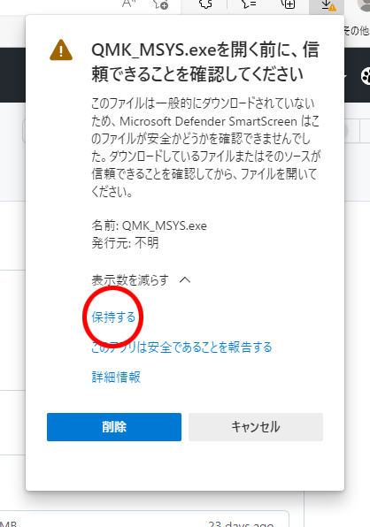

# 動作テスト

LHP14fはQMK firmwareという、キーボード用のオープンソースファームウェアで動作します。  
当方の現環境であるwindows11、QMK MSYS 1.7.2(QMK ver 0.18.5)、QMK Toolbox(ver 0.2.2) を使って説明します。
 
 
 

### １．QMK-MSYSのセットアップ

・[公式サイト](https://msys.qmk.fm/)からLatest versionのQMK_MSYS.exeをダウンロードします。

ダウンロード時、警告のメッセージが出ますが、赤丸部分をクリックしてダウンロードします。
 
 
 
・ダウンロードしたQMK_MSYS.exeを実行します。

 
 
 

・QMK MSYSを起動します。   
　黒い画面が開き、＄が出たら、qmk setupと打ち込み、エンターを押します。

・設問が出ますが全てy(es)で答えます。

・cloning into...　と出てファイルのアップデートが始まりますが、終わるまで待ちます。

・QMK is ready to goと出て、＄の横にカーソルが出てきたらQMK MSYSセットアップ完了です！
 
 
 

### ２．QMK Toolboxのインストール

・[公式サイト](https://github.com/qmk/qmk_toolbox/releases)からqmk_toolbox_install.exeをダウンロードし実行します。  
同じように警告が出ますが、インストールを進めていきます。
 
 
 

### ３．テストファームの書き込み

・[LHP14ファームウェア置き場](https://github.com/LHPbackup/LHP14-firmware)からLHP14fのファームウェアをダウンロードします。  
　Codeと書いた緑のボタンを押し、Zipファイルをダウンロード、解凍します。

・C:\Users\ユーザー名\qmk_firmware\keyboards\に、lhp14fフォルダをフォルダごとコピーしてください。

・QMK Toolboxを起動します。

・Auto-Flashをチェックします。

 
 

・lhp14fフォルダ内のlhp14f_test.hexをQMK Toolboxにドラッグ＆ドロップします。

 
 

・PCにLHP14をつなぎ、リセットボタンを押すと（私のType-C ProMicroでは2度押し）ファームウェアが書き込まれます。

 
 
 

### 4．動作テスト

・テストファームの書き込みが成功するとRGBLEDを搭載している場合、赤緑青の順番で点灯します。

・OLEDのLayer表示が「RGB&KEY TEST」になっていることを確認します。 

・メモ帳などのテキストエディタを開いてLHP14の各キーを押し、対応した文字が出てくれば正常。

・レイヤースイッチを押し、OLEDのLayer表示をLED PARAMETERに切り替えてください。RGBLEDアニメーション変更（2行1列目）を押すと発光パターンが切り替わっていきます。リセット（2行2列目）でRGBLEDをリセットして全て赤に変わります。

・各キーの詳しい割り当ては\lhp14f\keymaps\test\のkeymap.cを参照してください。

 

・windowsコントロールパネル→ハードウェアとサウンド→デバイスとプリンタ→LHP14fを右クリックでゲームコントローラーの設定

 
 
プロパティでジョイスティックのテスト。    

設定タブ→調整でデバイス調整ウィザードに入り、LHP14をPCに設定します。

テストタブでジョイスティックを動かしカーソルが動く、ジョイスティック押しこみでボタン1が反応すればOKです。

 
 
 

### 5．キーマップ作成準備

製作したLHP14の、RGBLEDの有無やLEDの種類に応じて、ファームウエアのconfig.hファイルを書き換えます。

・lhp14fフォルダ直下にあるconfig.hファイルをメモ帳などのテキストエディタで開き、47行目の#define RGBLED_NUM 28の記述を編集します。  

　　　RGBLEDなし：`#define RGBLED_NUM 0`に変更

　　　テープLED：`#define RGBLED_NUM 6`に変更

　　　SK6812MINI-E：`#define RGBLED_NUM 28`（変更なし）

 
 
 

### お疲れ様でした。上手く動きましたか？？

 
 

[ ＞＞キーマップを作る](./LHP14f_make_layer.md/) 
