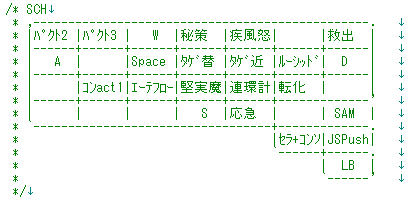
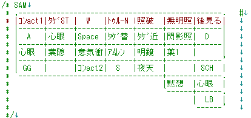

# キーマップを作る

**キーマップ製作例として、私のFF14キャラクターの学者、侍のキーマップを、mymap内のkeymap.cを編集しながら作ってみます。**

**今回の作例では、LHP14は学者、侍の2枚のレイヤーのみ動作し、学者→侍→学者→侍…の順でレイヤーが切り替わるよう作ります**。  
<br>
<br>
<br>

## ・keymap.cの編集

メモ帳、秀丸エディタなどのテキストエディターでlhp14fフォルダーのkeymaps/mymap内のkeymap.cを開きます。
<br>
<br>

### ・学者、侍のレイヤーを定義し、それ以外のジョブをカットする

// Layer(=job) MAX 32jobs available以下にDRK～RGBまで23行の記述がありますが下記2行に変更し、それ以外はカット。

```
#define SCH 0
#define SAM 1
```

switch (get_highest_layer(layer_state)) {以下の、case DRK～case RGBまでの記述を下記に変更し、残りはカット。

```
        case SCH:
            oled_write_P(PSTR("SCHOLAR\n"), false);
            rgblight_sethsv(20, 255, 210);
            break;

        case SAM:
            oled_write_P(PSTR("SAMURAI\n"), false);
            rgblight_sethsv(0, 255, 180);
            break;
```

**RGBLEDの色の定義は[QMKのRGB Lightning](https://github.com/qmk/qmk_firmware/blob/master/docs/feature_rgblight.md)などを参考にしてください。**

<br>
<br>

### ・学者のキーマップを作る

**キーコードは[QMK公式ページキーコード表](https://docs.qmk.fm/#/keycodes)などを参考にしてください。**


上記が私の学者のHUDです。

ホットバー2はキーボードの1234567890-=までの12キー（英語キーボードです）がキーバインドされており、ホットバー3はシフトと1～=の同時押し、ホットバー4はALTと1～=の同時押し、ホットバー5はCTRLとALTと1～=の同時押しがバインドされています。
<br>
<br>
<br>
LHP14に下記の割り当てで学者のキーマップを作ってみます。
<br>

<br>
<br>

まずは1列目。

エーテルパクト<2>はホットバー５スロット5なので、CTRLとALTを押しながら5。これに対応したQMKのキーコードは`LCA(KC_5)`です。

エーテルパクト<3>はホットバー5スロット4なので、`LCA(KC_4)`

WはFF14のキー設定は「前を向いて前進」です。QMKでは`KC_W`になります。

秘策はホットバー3スロット8なのでシフトと8の同時押し、英語キーボードではアスタリスク、QMKでは`KC_ASTR`になります。

疾風怒濤はホットバー5スロット12なので、CTRLとALT同時押しの=。QMKでは`LCA(KC_EQL)`

救出はホットバー4スロット3なのでALTの3で`LALT(KC_3)`

これで1列目は完了です。

2列目以降も同じ手順で作っていくと、下記のようなキーマップが完成します。

```
  [SCH] = LAYOUT( \
    LCA(KC_5), LCA(KC_4), KC_W,       KC_ASTR,    LCA(KC_EQL),XXXXXXX,    LALT(KC_3),\
    KC_A,      XXXXXXX,   KC_SPC,     KC_F,       KC_T,       LALT(KC_4), KC_D,      \
    XXXXXXX,   KC_Z,      LALT(KC_6), LALT(KC_5), LALT(KC_1), LCA(KC_7),  XXXXXXX,   \
    XXXXXXX,   XXXXXXX,   XXXXXXX,    KC_S,       KC_7,                   TO(SAM),   \
                                                              LALT(KC_0), JS_BUTTON0,\
                                                                          KC_F12     \
  ),
```

【特記事項】

・4行6列目（4行目のいちばん右）はLHP14fではレイヤー切り替えのタクトスイッチに対応しており、`TO(SAM)`、すなわち侍のレイヤーへチェンジするキーコードを定義しております。

・JS_BUTTON0：スティックレバー押しこみ（FF14側はマクロ99を定義）

・ジャンプ：スペースキー

・ターゲット切り替え：F

・近くの敵にタゲ：T

・コンテンツアクション：Z

・私のFF14のファンクションキーF12はリミットブレイクが定義されており、ジョイスティック下のキー`KC_F12`でLBを打ちます。

・未定義のキーコードは`XXXXXXX`です。

<br>
<br>
<br>

### ・侍のキーマップを作る
<br>

<br>
上記が私の侍のHUDレイアウトです。主にスロット２，３，４で操作しております。
<br>
<br>
<br>

LHP14に下記の割り当てで侍のキーマップを作ってみます。
<br>

<br>
<br>
```
[SAM] = LAYOUT( \
 KC_Z,        KC_F2,     KC_W,        LALT(KC_1),LALT(KC_4),   KC_PLUS,    KC_V,      \
 KC_A,        KC_HASH,   KC_SPC,      KC_F,      KC_T,         SE_SH,      KC_D,      \
 KC_HASH,     LALT(KC_5),LALT(KC_2),  KC_AMPR,   KC_ASTR,      LALT(KC_0), XXXXXXX,   \
 LCA(KC_MINS),XXXXXXX,   LCA(KC_EQL) ,KC_S,      LALT(KC_MINS),            TO(SCH),   \
                                                               LALT(KC_3), KC_HASH,   \
                                                                           KC_F12  
),
```

【特記事項】

・カスタムキーコード「SE_SH」を定義します。

```
enum custom_keycodes {
SE_SH = SAFE_RANGE
};
```

`SE_SH`をキーコードとして定義

```
bool process_record_user(uint16_t keycode, keyrecord_t *record) {
  switch (keycode) {
     case SE_SH:
      if (record->event.pressed) {
        SEND_STRING(SS_LALT("4") SS_LALT("9"));
      }
      break;
  }
  return true;
}
```

コードの動作を記述。

キーが押されたら、ホットバー4スロット4の照破とホットバー4スロット9の閃影のボタンを同時押しします。  
<br>
<br>
・スティック押し込み：マクロ99ではなく心眼を定義

・ファンクションキーF2：STがタゲっている敵をタゲ（FF14マクロ）

・後ろ見る（フリップカメラ）：V

・GG：絶竜詩 聖杖GGパターン隕石設置（FF14マクロ）

・コンテンツアクション2（FF14マクロ）

<br>
<br>
<br>

### ・キーマップの完成

下記が完成したサンプルキーマップです。

```
#include QMK_KEYBOARD_H
#include "joystick.h"
#include "analog.h"


// Layer(=job) MAX 32jobs available
#define SCH 0
#define SAM 1


void render_logo(void) {
    oled_set_cursor(0, 0);
    oled_write_P(lhp_logo, false);
}

enum custom_keycodes {
  SE_SH = SAFE_RANGE
};

bool process_record_user(uint16_t keycode, keyrecord_t *record) {
  switch (keycode) {
     case SE_SH:
      if (record->event.pressed) {
        SEND_STRING(SS_LALT("4") SS_LALT("9"));
      }
      break;
  }
  return true;
}


void render_layer(void) {    
    oled_set_cursor(0, 3);
    // Host Keyboard Layer Status
    oled_write_P(PSTR("Layer: "), false);

    switch (get_highest_layer(layer_state)) {

        case SCH:
            oled_write_P(PSTR("SCHOLAR\n"), false);
            rgblight_sethsv(20, 255, 210);
            break;

        case SAM:
            oled_write_P(PSTR("SAMURAI\n"), false);
            rgblight_sethsv(0, 255, 180);
            break;

        default:
            // Or use the write_ln shortcut over adding '\n' to the end of your string
            oled_write_ln_P(PSTR("Undefined"), false);
    }
}

bool oled_task_user(void) {
    render_logo();
    render_layer();
    return false;
}


void suspend_power_down_kb(void) {
    oled_off();
}

void suspend_wakeup_init_kb(void) {
    oled_on();
}


const uint16_t PROGMEM keymaps[][MATRIX_ROWS][MATRIX_COLS] = {

  /* SCH
   * ,------------------------------------------------.   
   * |ﾊﾟｸﾄ2 |ﾊﾟｸﾄ3 |   W  |秘策  |疾風怒|      |救出  |   
   * |------+------+------+------+------+------+------|   
   * |   A  |      |Space |ﾀｹﾞ替 |ﾀｹﾞ近 |ﾙｰｼｯﾄﾞ|  D   |   
   * |------+------+------+------+------+------+------|   
   * |      |ｺﾝact1|ｴｰﾃﾌﾛｰ|堅実魔|連環計|転化  |      |   
   * |------+------+------+------+------+-------------'   
   * |      |      |      |   S  |応急  |      | SAM  |   
   * `----------------------------------+-------------.   
   *                                    |ｾﾗ+ｺﾝｿ|JSPush|   
   *                                    `------+------.   
   *                                           |  LB  |   
   *                                           `------'   
   */
  [SCH] = LAYOUT( \
    LCA(KC_5), LCA(KC_4), KC_W,       KC_ASTR,    LCA(KC_EQL),XXXXXXX,    LALT(KC_3),\
    KC_A,      XXXXXXX,   KC_SPC,     KC_F,       KC_T,       LALT(KC_4), KC_D,      \
    XXXXXXX,   KC_Z,      LALT(KC_6), LALT(KC_5), LALT(KC_1), LCA(KC_7),  XXXXXXX,   \
    XXXXXXX,   XXXXXXX,   XXXXXXX,    KC_S,       KC_7,                   TO(SAM),   \
                                                              LALT(KC_0), JS_BUTTON0,\
                                                                          KC_F12     \
   ),

  /* SAM
   * ,------------------------------------------------.   #
   * |ｺﾝact1|ﾀｹﾞST |  W   |ﾄｩﾙｰN l照破  |無明照|後見る|   
   * |------+------+------+------+------+------+------|   
   * |  A   |心眼  |Space |ﾀｹﾞ替 |ﾀｹﾞ近 |閃影照|  D   |   
   * |------+------+------+------+------+------+------|   
   * |心眼  |葉隠  |意気衝|ｱﾑﾚﾝ  |明鏡  |薬1   |      |   
   * |------+------+------+------+------+-------------'   
   * | GG   |      |ｺﾝact2|  S   |夜天  |      | SCH  |   
   * `----------------------------------+-------------.   
   *                                    |黙想  |心眼  |   
   *                                    `------+------.   
   *                                           |  LB  |   
   *                                           `------'   
   */
   [SAM] = LAYOUT( \
    KC_Z,        KC_F2,     KC_W,        LALT(KC_1),LALT(KC_4),   KC_PLUS,    KC_V,      \
    KC_A,        KC_HASH,   KC_SPC,      KC_F,      KC_T,         SE_SH,      KC_D,      \
    KC_HASH,     LALT(KC_5),LALT(KC_2),  KC_AMPR,   KC_ASTR,      LALT(KC_0), XXXXXXX,   \
    LCA(KC_MINS),XXXXXXX,   LCA(KC_EQL), KC_S,      LALT(KC_MINS),            TO(SCH),   \
                                                                  LALT(KC_3), KC_HASH,   \
                                                                              KC_F12  
   ),

};


joystick_config_t joystick_axes[JOYSTICK_AXES_COUNT] = {
    [0] = JOYSTICK_AXIS_VIRTUAL,
    [1] = JOYSTICK_AXIS_VIRTUAL
};

void matrix_scan_user(void) {

    joystick_status.axes[0] = analogReadPin(F4)/4 - 128;
    joystick_status.axes[1] = analogReadPin(D4)/4 - 128;
    joystick_status.status |= JS_UPDATED;
}
```

<br>
<br>
<br>

### ・ファームウェアのビルドと書き込み

・QMK MSYSを起動します。

・＄が出たら、cd qmk_firmwareと打ち込んでエンターを押します。

・make lhp14f:mymapと打ち込んでエンターを押すとビルドが始まります。

・コードにエラーがなければ、C:/Users/ユーザー名/qmk_firmware/.build/にlhp14f_mymap.hexというファイルが出来ていると思います。

・QMK Toolboxを起動し、hexファイルをドラッグ＆ドロップします。

・Auto-FlashをチェックしてLHP14を繋いだらリセットを押し（2回）、ファームを書き込みます。

・LHP14のレイヤーキーを押し、レイヤーが学者⇔侍に切り替わることを確認します。

<br>
<br>
<br>

・LHP14f\keymaps\defaultには私がFF14で使っているキーコードがサンプルとして入っております。 良ければこちらも参考にしてください。
<br>
<br>
<br>

### それでは、ユーザー様独自のキーマップを作ってみましょう！

<br>
<br>

[ ＞＞Photo](./LHP14_photo.md/) 
