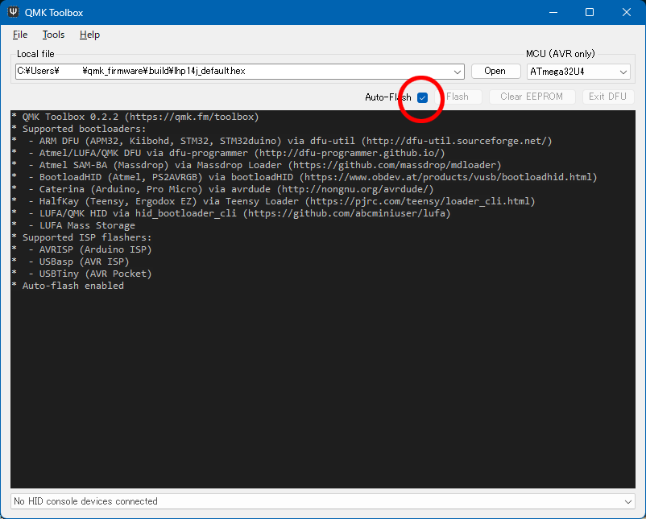
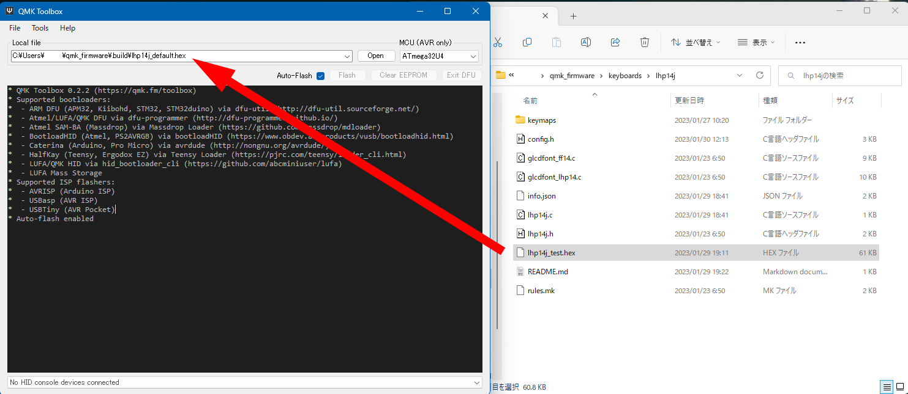
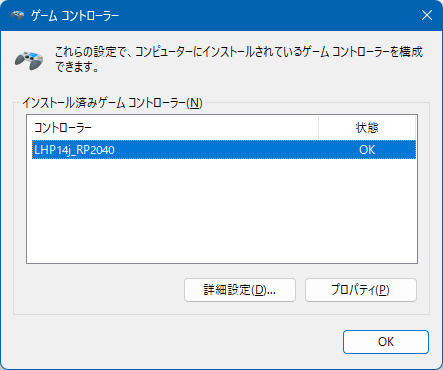
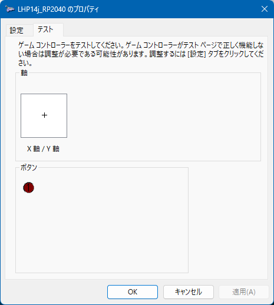

# 動作テスト

LHP14jはQMK firmwareという、キーボード用のオープンソースファームウェアで動作します。  
当方の現環境であるwindows11、QMK MSYS 1.7.2(QMK ver 0.20.0)、QMK Toolbox(ver 0.2.2) を使って説明します。
 
 
 

### １．QMK-MSYSのセットアップ

・[公式サイト](https://msys.qmk.fm/)からLatest versionのQMK_MSYS.exeをダウンロードします。
 
 

 

 

 
 
ダウンロード時、警告のメッセージが出ますが、赤丸部分をクリックしてダウンロードします。
 
 
 
・ダウンロードしたQMK_MSYS.exeを実行します。

 
 
 

・QMK MSYSを起動します。   
　黒い画面が開き、＄が出たら、qmk setupと打ち込み、エンターを押します。

・設問が出ますが全てy(es)で答えます。

・cloning into...　と出てファイルのアップデートが始まりますが、終わるまで待ちます。

・QMK is ready to goと出て、＄の横にカーソルが出てきたらQMK MSYSセットアップ完了です。
 
 
 

# RP2040使用時の注意点

## ## QMK Breaking Change 2023 Feb 26 以降のバージョンをお使いください。

 
 
 

### ２．QMK Toolboxのインストール（RP2040では必要ありません）

・[公式サイト](https://github.com/qmk/qmk_toolbox/releases)からqmk_toolbox_install.exeをダウンロードし実行します。  
同じように警告が出ますが、インストールを進めていきます。
 
 
 

### ３．テストファームの書き込み

・[LHP14ファームウェア置き場](https://github.com/LHPbackup/LHP14-firmware)からLHP14jのファームウェアをダウンロードします。  
　Codeと書いた緑のボタンを押し、Zipファイルをダウンロード、解凍します。  
 
 

**ATmega32U4搭載ProMicroをお使いの場合**

・C:\Users\ユーザー名\qmk_firmware\keyboards\に、lhp14jフォルダをフォルダごとコピーしてください。

・QMK Toolboxを起動します。

・Auto-Flashをチェックします。

 
 

・lhp14jフォルダ内のlhp14j_test.hexをQMK Toolboxにドラッグ＆ドロップします。

 
 
 

・PCにLHP14をつなぎ、リセットボタンを押すと（ProMicroによっては2度押し）ファームウェアが書き込まれます。

 
 

**RP2040をお使いの場合**

・C:\Users\ユーザー名\qmk_firmware\keyboards\に、lhp14j_rp2040フォルダをフォルダごとコピーしてください。

・PCにLHP14をつなぎ、LHP14のリセットスイッチをダブルクリックするとウインドウが開きます。  

・lhp14j_rp2040フォルダ内のlhp14j_rp2040_test_sparkfun.uf2(Adafruit KB2040をお使いの際はlhp14j_rp2040_test_adafruit.uf2)を開いたウィンドウにドラッグ＆ドロップします。  

・RP2040では拡張子がuf2のファイルをファームウエアとして使用します。QMKでRP2040のファームをビルドするとuf2ファイルが生成されます。  

 
 
 

### 4．動作テスト

・テストファームの書き込みが成功するとRGBLEDを搭載している場合、赤緑青の順番で点灯します。

・OLEDのLayer表示が「RGB&KEY TEST」になっていることを確認します。 

・メモ帳などのテキストエディタを開いてLHP14の各キーを押し、対応した文字が出てくれば正常。

・レイヤースイッチを押し、OLEDのLayer表示をLED PARAMETERに切り替えてください。RGBLEDアニメーション変更（2行1列目）を押すと発光パターンが切り替わっていきます。リセット（2行2列目）でRGBLEDをリセットして全て赤に変わります。

・LEDの動作テストを終わる際はLEDをリセットしてから終了してください。  

・各キーの詳しい割り当ては\lhp14j\keymaps\test\のkeymap.cを参照してください。

 

・windowsコントロールパネル→ハードウェアとサウンド→デバイスとプリンタ→LHP14j(_RP2040)を右クリックでゲームコントローラーの設定  

 
 
プロパティでジョイスティックのテスト。    

設定タブ→調整でデバイス調整ウィザードに入り、LHP14をPCに設定します。

テストタブでジョイスティックを動かしカーソルが動く、ジョイスティック押しこみでボタン1が反応すればOKです。

 
 
 

### 5．キーマップ作成準備

製作したLHP14のProMicroの種類、RGBLEDの有無やLEDの種類に応じて、ファームウエアのinfo.jsonファイルを書き換えます。

lhp14j(_rp2040)フォルダ直下にあるinfo.jsonファイルをメモ帳などのテキストエディタで開き、必要に応じて書き換えます。  

【SparkFun・Adafruit2040】  
・SparkFun RP2040をご使用の場合：16行目を有効化して、17行目  
`"cols": ["GP4", "GP27", "GP26", "GP18", "GP20", "GP19", "GP10", "GP5", "GP1"], `  
をコメントアウト（先頭に//をつける）    

・Adafruit KB2040をご使用の場合：17行目を有効化して、16行目  
`"cols": ["GP4", "GP27", "GP26", "GP22", "GP20", "GP23", "GP21", "GP5", "GP1"],`  
をコメントアウト（先頭に//をつける）

【LEDの有無・種類】  

　　　テープLED：`"led_count": 6,`に変更

　　　SK6812MINI-E or RGBLEDなし：`"led_count": 28,`（変更なし）

　　　※`"led_count": 28,`以外の場合は次の行の`"led_map": [6, 5, 4, 3, 2, 1, 0, 7, 8, 9, 10, 11, 12, 13, 20, 19, 18, 17, 16, 15, 14, 21, 22, 23, 24, 25, 26, 27]`は削除するか、コメントアウトしてください。
　    

 
 
 

### お疲れ様でした。上手く動きましたか？？

 
 

[ ＞＞キーマップを作る](./LHP14j_make_layer.md/) 
