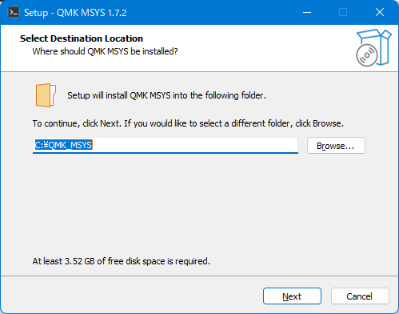
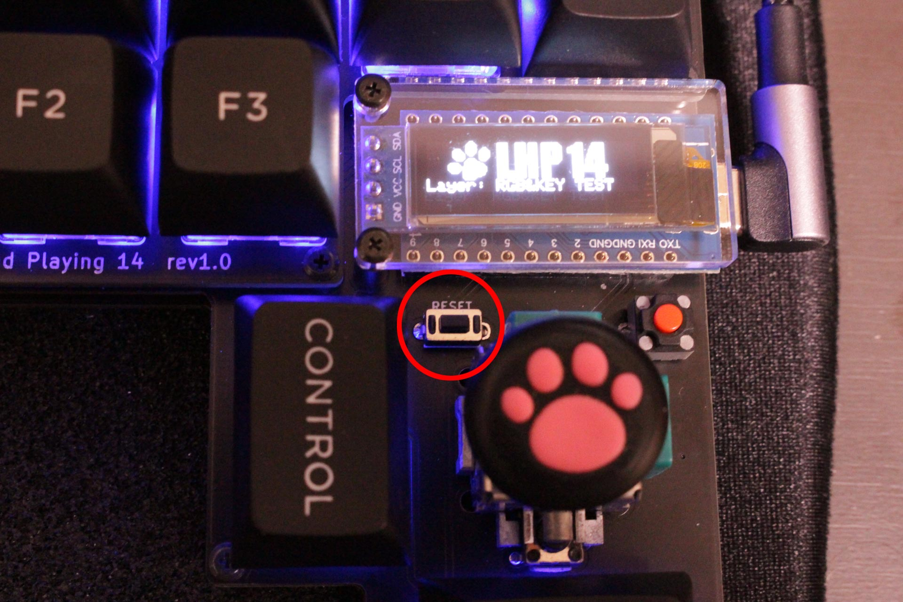

# 動作テスト

LHP14jはQMK firmwareという、キーボード用のオープンソースファームウェアで動作します。  
当方の現環境であるwindows11、QMK MSYS 1.7.2(QMK ver 0.19.10)、QMK Toolbox(ver 0.2.2) を使って説明します。
 
 
 

### １．QMK-MSYSのセットアップ

・[公式サイト](https://msys.qmk.fm/)からLatest versionのQMK_MSYS.exeをダウンロードします。
 
 

 

 

 
 
ダウンロード時、警告のメッセージが出ますが、赤丸部分をクリックしてダウンロードします。
 
 
 
・ダウンロードしたQMK_MSYS.exeを実行します。

 
 
 

・QMK MSYSを起動します。   
　黒い画面が開き、＄が出たら、qmk setupと打ち込み、エンターを押します。

・設問が出ますが全てy(es)で答えます。

・cloning into...　と出てファイルのアップデートが始まりますが、終わるまで待ちます。

・QMK is ready to goと出て、＄の横にカーソルが出てきたらQMK MSYSセットアップ完了です。
 
 
 

# RP2040使用時の注意点

## 現在最新のQMKではRP2040のアナログ関連ファイルがアクティベートされていないため、ビルドできません。

## QMKのメジャーアップデート（Breaking Change 2023 Feb 26）までお待ち頂くか、＃[19453](https://github.com/qmk/qmk_firmware/pull/19453)、＃[19652](https://github.com/qmk/qmk_firmware/pull/19652)のパッチを当てて下さい。

 
 
 

### ２．QMK Toolboxのインストール（RP2040では必要ありません）

・[公式サイト](https://github.com/qmk/qmk_toolbox/releases)からqmk_toolbox_install.exeをダウンロードし実行します。  
同じように警告が出ますが、インストールを進めていきます。
 
 
 

### ３．テストファームの書き込み

・[LHP14ファームウェア置き場](https://github.com/LHPbackup/LHP14-firmware)からLHP14jのファームウェアをダウンロードします。  
　Codeと書いた緑のボタンを押し、Zipファイルをダウンロード、解凍します。  
 
 

**ATmega32U4搭載ProMicroをお使いの場合**

・C:\Users\ユーザー名\qmk_firmware\keyboards\に、lhp14jフォルダをフォルダごとコピーしてください。

・QMK Toolboxを起動します。

・Auto-Flashをチェックします。

 
 

・lhp14jフォルダ内のlhp14j_test.hexをQMK Toolboxにドラッグ＆ドロップします。

 
 
 

・PCにLHP14をつなぎ、リセットボタンを押すと（ProMicroによっては2度押し）ファームウェアが書き込まれます。

 
 

**RP2040をお使いの場合**

・C:\Users\ユーザー名\qmk_firmware\keyboards\に、lhp14j_rp2040フォルダをフォルダごとコピーしてください。

・PCにLHP14をつなぎ、LHP14のリセットスイッチをダブルクリックするとウインドウが開きます。  

・lhp14j_rp2040フォルダ内のlhp14j_rp2040_test_sparkfun.uf2(Adafruit KB2040をお使いの際はlhp14j_rp2040_test_adafruit.uf2)を開いたウィンドウにドラッグ＆ドロップします。  

・RP2040では拡張子がuf2のファイルをファームウエアとして使用します。QMKでRP2040のファームをビルドするとhexファイル以外にuf2ファイルも生成されますのでこちらをお使いください。  

 
 
 

### 4．動作テスト

・テストファームの書き込みが成功するとRGBLEDを搭載している場合、赤緑青の順番で点灯します。

・OLEDのLayer表示が「RGB&KEY TEST」になっていることを確認します。 

・メモ帳などのテキストエディタを開いてLHP14の各キーを押し、対応した文字が出てくれば正常。

・レイヤースイッチを押し、OLEDのLayer表示をLED PARAMETERに切り替えてください。RGBLEDアニメーション変更（2行1列目）を押すと発光パターンが切り替わっていきます。リセット（2行2列目）でRGBLEDをリセットして全て赤に変わります。

・各キーの詳しい割り当ては\lhp14j\keymaps\test\のkeymap.cを参照してください。

 

・windowsコントロールパネル→ハードウェアとサウンド→デバイスとプリンタ→LHP14j(_RP2040)を右クリックでゲームコントローラーの設定  

 
 
プロパティでジョイスティックのテスト。    

設定タブ→調整でデバイス調整ウィザードに入り、LHP14をPCに設定します。

テストタブでジョイスティックを動かしカーソルが動く、ジョイスティック押しこみでボタン1が反応すればOKです。

 
 
 

### 5．キーマップ作成準備

製作したLHP14の、RGBLEDの有無やLEDの種類に応じて、ファームウエアのconfig.hファイルを書き換えます。

・lhp14j(_rp2040)フォルダ直下にあるconfig.hファイルをメモ帳などのテキストエディタで開き、#define RGBLED_NUM 28の記述を編集します。  

　　　テープLED：`#define RGBLED_NUM 6`に変更

　　　SK6812MINI-E or RGBLEDなし：`#define RGBLED_NUM 28`（変更なし）

 
 
 

### お疲れ様でした。上手く動きましたか？？

 
 

[ ＞＞キーマップを作る](./LHP14j_make_layer.md/) 
